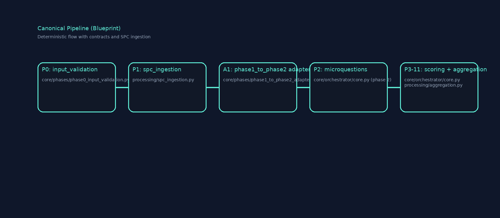
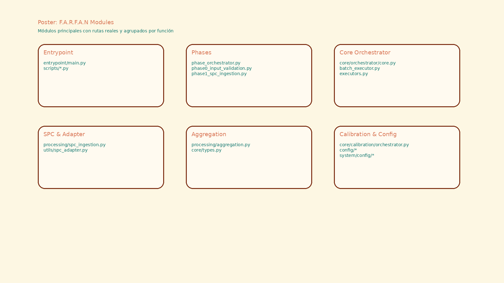

# Opciones de Diagramas (selección previa)

Tres propuestas visuales generadas como PNG (sin Mermaid) para elegir. Rutas relativas dentro del repo:

- `docs/CANONIC_COMPENDIUM/images/architecture_option1.png`
- `docs/CANONIC_COMPENDIUM/images/pipeline_option2.png`
- `docs/CANONIC_COMPENDIUM/images/modules_option3.png`

### Opción 1 — Arquitectura en capas (fondo claro, acentos cyan)

### Opción 2 — Pipeline blueprint oscuro

### Opción 3 — Módulos en tarjetas (poster crema)

