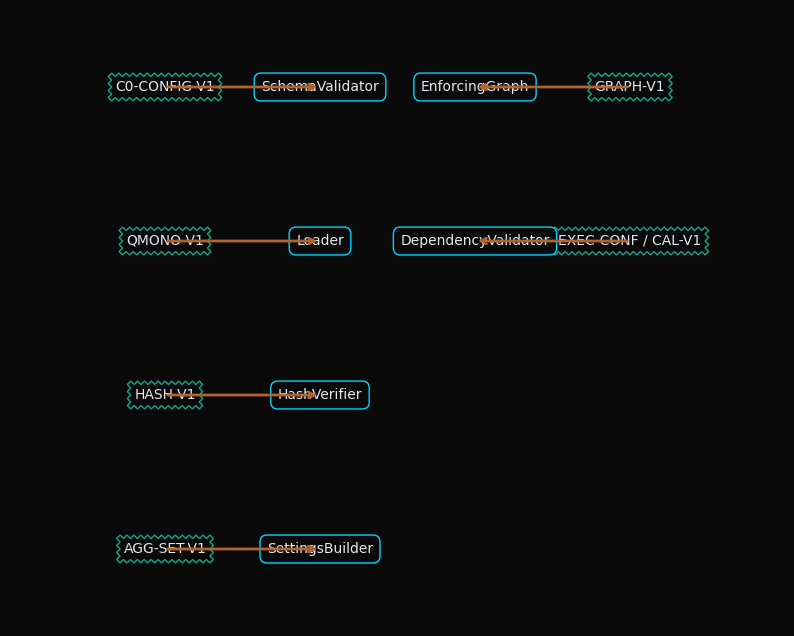

# A Sociotechnical Framework for Pre-computation Validation in Mechanistic Policy Pipelines

**P00-EN v1.0**

## Abstract
This paper outlines the design and function of Phase 0 (N0), the initial validation node in the F.A.R.F.A.N. mechanistic policy pipeline. Phase 0 serves as a critical sociotechnical control point, ensuring the integrity, determinism, and reliability of the entire system before computational processes begin. By enforcing a series of strict, automated checks on configuration, dependencies, and core assets, this phase acts as a safeguard against systemic failures that could otherwise propagate through the pipeline. We argue that this pre-computation validation is not merely a technical prerequisite but a foundational element of a well-designed sociotechnical system, fostering trust, reducing operator ambiguity, and ensuring that the subsequent human-machine interactions are based on a stable, verified technical foundation.

## 1. Introduction

The F.A.R.F.A.N. mechanistic policy pipeline is a complex system designed to ingest, analyze, and score policy documents. The outputs of this pipeline are intended to inform high-stakes decision-making processes. As such, the reliability and correctness of the system are paramount. From a sociotechnical systems theory perspective, the pipeline is not just a collection of algorithms and data structures; it is a system where human operators, analysts, and decision-makers interact with a sophisticated technical apparatus. The quality of these interactions, and thus the overall efficacy of the system, is highly dependent on the stability and predictability of the technical subsystem.

Phase 0 (N0) of the pipeline is designed to establish this stability. It is a non-negotiable, automated gateway that validates the entire system's configuration before any document-specific processing is initiated. This phase operationalizes the principle of "joint optimization" by ensuring that the technical system is in a known, correct state, thereby enabling the social system (the users and operators) to interact with it effectively and with confidence. By catching configuration errors, dependency mismatches, or corrupted assets at the earliest possible stage, Phase 0 prevents the costly and trust-eroding propagation of errors that can result from a poorly configured technical environment. This paper details the methodology and results of this sociotechnical validation framework.

## 2. Methodology: A Sociotechnical Validation Framework

The methodology of Phase 0 is built upon a series of contractual obligations that the system's configuration must meet. These contracts are enforced through a deterministic, sequential flow of validation steps.

### 2.1. Input and Output Contracts

The validation process begins with an **Input Contract**, which defines the expected state of the `config` dictionary that initializes the pipeline. This contract specifies required keys (`monolith_path`, `questionnaire_hash`, etc.), data types, and preconditions, such as the immutability of configuration objects and the correctness of the defined phase graph. Forbidden inputs, such as references to deprecated or experimental system components (e.g., node N2), are explicitly rejected.

Upon successful validation, Phase 0 produces an **Output Contract**. This is not merely a pass-through of the input but an enriched and verified state. The output includes the loaded and hash-verified canonical questionnaire, initialized `AggregationSettings`, and a locked-down phase graph, ensuring that the rest of the pipeline operates on a consistent and trusted data foundation.

### 2.2. Internal Validation Flow

The internal flow of Phase 0 is a sequence of validation sub-nodes, each responsible for a specific aspect of the system's configuration:

1.  **Schema Validation:** The initial step verifies the presence and correct types of all required keys in the input `config` dictionary.
2.  **Questionnaire Loading and Verification:** The canonical questionnaire, a central knowledge asset, is loaded, and its SHA-256 hash is verified against the value in the `config`. This ensures the integrity and immutability of the system's core analytical logic.
3.  **Phase Graph Enforcement:** The pipeline's execution path is validated to ensure it contains only active, authorized nodes. This prevents the execution of experimental or deprecated code paths.
4.  **Dependency Validation:** The configurations for executors, calibration profiles, and other dependencies are loaded and validated, ensuring that all necessary components for the run are present and correctly specified.
5.  **Emission:** The fully validated and enriched configuration object is cached in the orchestrator's context, ready for the subsequent phases.

This structured flow ensures that the technical subsystem is "ready for work" before it is engaged by the social subsystem, thereby preventing a class of errors that are often difficult to diagnose and can undermine user trust.

## 3. Results: System State and Contract Enforcement

The successful execution of Phase 0 results in a deterministic and verified initial state for the pipeline. The structure of this validation process is visualized through a series of graphs that represent the flow of control, data, state transitions, and contractual linkages.

### 3.1. Control-Flow and Data-Flow

The **Control-Flow Graph** illustrates the decision-making logic of Phase 0, showing how a configuration input is either validated and emitted or rejected upon failure. The **Data-Flow Graph** shows how raw configuration data is transformed and augmented by a series of validators and builders to produce the final, validated configuration object.

### 3.2. State-Transition and Contract-Linkage

The **State-Transition Graph** models the state of the Phase 0 node itself, moving from `Idle` to `Validating` and then to either `Faulted` or `Emitting`. This provides a clear model of the node's lifecycle. The **Contract-Linkage Graph** visualizes how each step in the validation process is governed by a specific versioned contract (e.g., `C0-CONFIG-V1`, `QMONO-V1`), ensuring that the validation logic itself is modular and maintainable.

### 3.3. Complexity Constraints

The design of Phase 0 is intentionally constrained to maintain low complexity and high reliability. It is composed of a maximum of six sub-nodes with a decision depth of no more than four. This ensures that the validation process itself is not a source of errors and can be easily understood and audited.

## 4. Discussion: Error Handling and System Boundaries

The validation framework of Phase 0 has significant implications for the sociotechnical resilience of the F.A.R.F.A.N. pipeline.

### 4.1. Proactive Error Handling

The error handling strategy of Phase 0 is proactive and strict. For example, a hash mismatch or a missing dependency results in an immediate and clean abort of the run, with a clear message to the operator. The system deliberately avoids falling back to default or "best-guess" configurations. From a sociotechnical standpoint, this design choice is critical. It reduces ambiguity for the human operator and prevents the system from entering an indeterminate state that could lead to difficult-to-interpret results. This predictability builds trust and reinforces the role of the operator as a supervisor of a deterministic system, rather than a troubleshooter of a chaotic one.

### 4.2. Defining System Boundaries

Phase 0 plays a crucial role in defining the boundaries between the F.A.R.F.A.N. system and its environment. The **Upstream Contract** requires that the external invocation mechanism (e.g., a CLI or API) provides an immutable configuration. This prevents undesirable "mid-run" modifications that could violate the assumptions of the pipeline. The **Downstream Contract** guarantees that the next phase (N1, Document Ingestion) receives a fully validated configuration. These explicit boundaries create a clear separation of concerns, which is a hallmark of well-designed, maintainable systems.

## 5. Conclusion

Phase 0 of the F.A.R.F.A.N. pipeline is more than a simple configuration check. It is a carefully designed sociotechnical control system that establishes a foundation of trust and reliability for all subsequent operations. By applying a rigorous, contract-based validation methodology, it ensures the "joint optimization" of the technical and social components of the pipeline. The technical system is guaranteed to be in a correct and deterministic state, while the social system of operators and analysts is shielded from the ambiguity and potential for error that arises from an un-validated configuration. This approach demonstrates that a focus on the initial state and boundaries of a complex computational system is a critical investment in its overall success and utility.

## References
*(Placeholder for future citations)*

## Appendix: Change Management
- Any new configuration field must be reflected in this document and its Spanish counterpart.
- Changes to the hashing policy or the initialization of `AggregationSettings` require a version increment of this document (e.g., `P00-EN_v1.1`).
