# Phase 0 (P0): Pre-Execution Validation & Deterministic Bootstrap Framework

**P00-EN v2.0** | **Last Updated**: 2025-11-28 | **Status**: Production

---

## 🎯 Executive Summary

Phase 0 is the **strict validation gateway** that establishes deterministic execution conditions for the F.A.R.F.A.N mechanistic policy pipeline. It enforces a zero-tolerance policy for configuration errors, dependency mismatches, and compromised integrity—ensuring that **all subsequent phases operate on a verified, immutable foundation**.

**Critical Design Principle**: *Fail fast, fail clean, fail deterministically*. Phase 0 **never** falls back to defaults, **never** proceeds with partial configurations, and **never** allows ambiguous error states.

### Key Metrics

| Metric | Requirement | Status |
|--------|-------------|--------|
| **Bootstrap Success Rate** | 100% on valid configs | ✅ **ENFORCED** |
| **Module Shadowing Detection** | Pre-import validation | ✅ **ENFORCED** |
| **Input Hash Verification** | SHA-256 cryptographic proof | ✅ **ENFORCED** |
| **Boot Check Gating** | PROD: zero tolerance | ✅ **ENFORCED** |
| **Determinism Seeding** | Python RNG mandatory | ✅ **ENFORCED** |
| **Error Surface** | Empty on P0 success | ✅ **ENFORCED** |

---

##  1. Introduction: The Sociotechnical Gateway

### 1.1 Problem Statement

High-stakes policy analysis pipelines suffer from three critical failure modes:

1. **Configuration Drift**: Undetected environment mismatches produce non-deterministic results
2. **Silent Degradation**: Partial failures cascade through the pipeline as "acceptable" deviations  
3. **Trust Erosion**: Operators cannot distinguish between "the system worked correctly" and "the system worked despite broken prerequisites"

### 1.2 Phase 0 Solution Architecture

Phase 0 implements a **strict contract-based validation framework** consisting of four sub-phases:

```
P0.0: Bootstrap          → Runtime config, seed registry, manifest builder
P0.1: Input Verification → Cryptographic hash validation of plan & questionnaire  
P0.2: Boot Checks        → Dependency validation (PROD: fatal, DEV: warn)
P0.3: Determinism        → RNG seeding with mandatory python seed

EXIT GATE: self.errors MUST be empty ∧ _bootstrap_failed = False
```

**Design Rationale**: Each sub-phase is **independently verifiable**, **cryptographically traceable**, and **strictly gated**. Failure at any sub-phase triggers immediate abort with structured error claims.

---

## 2. Phase Architecture & Flow

### 2.1 Control Flow Diagram

```mermaid
flowchart TD
    A[«START» cli Entry Point] --> B{Module Shadowing Check}
    B -->|PASS| C[main Parse Args]
    B -->|FAIL| Z1[Write Minimal Manifest<br/>PIPELINE_VERIFIED=0<br/>Exit 1]
    
    C --> D[«P0.0» VerifiedPipelineRunner::__init__]
    D --> E{RuntimeConfig.from_env}
    E -->|FAIL| F[Set _bootstrap_failed=True<br/>Append to errors]
    E -->|PASS| G{artifacts_dir.mkdir}
    G -->|FAIL| F
    G -->|PASS| H[Log bootstrap/start claim]
    
    H --> I[«P0.1» verify_input]
    I --> J{All inputs exist & hashed?}
    J -->|FAIL| K[Append to errors]
    J -->|PASS| L{self.errors empty?}
    L -->|NO| M[Generate manifest success=False<br/>Return False]
    L -->|YES| N[«P0.2» run_boot_checks]
    
    N --> O{BootCheckError?}
    O -->|YES + PROD| P[Append to errors<br/>Raise exception]
    O -->|YES + DEV| Q[Log warning claim<br/>Continue]
    O -->|NO| R{self.errors empty?}
    R -->|NO| M
    R -->|YES| S[«P0.3» _initialize_determinism_context]
    
    S --> T{python seed exists?}
    T -->|NO| U[Set _bootstrap_failed=True<br/>Append to errors]
    T -->|YES| V[random.seed python_seed]
    
    V --> W{self.errors empty?}
    W -->|NO| M
    W -->|YES| X[«Phase 1» run_spc_ingestion]
    X --> Y[SUCCESS<br/>PIPELINE_VERIFIED=1]
    
    F --> M
    K --> M
    P --> M
    U --> M
    
    style A fill:#e1f5e1
    style Z1 fill:#ffe1e1
    style X fill:#e1e5ff
    style Y fill:#d4edda
    style M fill:#f8d7da
```



### 2.2 Data Flow: Configuration Enrichment


### 2.3 State Transition Model


---

## 3. Sub-Phase Specifications

### 3.1 P0.0: Bootstrap

**Purpose**: Initialize core runner infrastructure with validated runtime configuration.

**Contract**:
```python
PRECONDITIONS:
  - SAAAAAA_RUNTIME_MODE ∈ {prod, dev, exploratory}
  - MODULE_PATH matches expected prefix
  - artifacts_dir parent exists OR is creatable

POSTCONDITIONS:
  - self.runtime_config: Optional[RuntimeConfig] is set
  - self._bootstrap_failed: bool reflects init status
  - artifacts_dir exists with proper permissions
  - bootstrap/start claim logged on success
```

**Implementation**:
```python
def __init__(self, plan_pdf_path: Path, artifacts_dir: Path):
    self._bootstrap_failed: bool = False
    self.errors: List[str] = []
    
    # Load runtime config
    self.runtime_config: Optional[RuntimeConfig] = None
    try:
        self.runtime_config = RuntimeConfig.from_env()
        self.log_claim("start", "runtime_config", ...)
    except Exception as e:
        self.log_claim("error", "runtime_config", str(e))
        self.errors.append(f"Failed to load runtime config: {e}")
        self._bootstrap_failed = True
    
    # Create artifacts directory
    try:
        self.artifacts_dir.mkdir(parents=True, exist_ok=True)
    except Exception as e:
        self.log_claim("error", "bootstrap", f"Artifacts dir creation failed: {e}")
        self.errors.append(str(e))
        self._bootstrap_failed = True
```

**Critical Gates**:
- ✅ `RuntimeConfig` must load without exception
- ✅ `artifacts_dir.mkdir()` must succeed  
- ✅ No implicit defaults if config is malformed

---

### 3.2 P0.1: Input Verification

**Purpose**: Cryptographically verify integrity of plan PDF and questionnaire monolith.

**Contract**:
```python
PRECONDITIONS:
  - plan_pdf_path.exists() = True
  - questionnaire_path.exists() = True

POSTCONDITIONS:
  - self.input_pdf_sha256: str = 64-char hex digest
  - self.questionnaire_sha256: str = 64-char hex digest  
  - input_verification/hash claims logged
  - self.errors empty OR contains specific file error
```

**Implementation**:
```python
def _verify_and_hash_file(self, file_path: Path, attr_name: str) -> bool:
    if not file_path.exists():
        error_msg = f"{attr_name} file not found: {file_path}"
        self.log_claim("error", "input_verification", error_msg)
        self.errors.append(error_msg)
        return False
    
    try:
        sha256_hash = compute_sha256(file_path)  # Streaming read
        setattr(self, attr_name, sha256_hash)
        self.log_claim("complete", "input_verification/hash", 
                      f"{attr_name} verified", {"hash": sha256_hash[:16]})
        return True
    except Exception as e:
        error_msg = f"Failed to hash {attr_name}: {e}"
        self.log_claim("error", "input_verification", error_msg)
        self.errors.append(error_msg)
        return False
```

**Exit Gate**:
```python
# In run() method
if not self.verify_input():
    self.generate_verification_manifest([], {})
    return False

# STRICT PHASE 0 EXIT GATE: Input Verification
if self.errors:
    self.log_claim("error", "phase0_gate", "Phase 0 failure: Errors detected after input verification")
    self.generate_verification_manifest([], {})
    return False
```

---

### 3.3 P0.2: Boot Checks

**Purpose**: Validate system dependencies (Python version, critical packages).

**Contract**:
```python
PRECONDITIONS:
  - self.runtime_config is not None

POSTCONDITIONS (PROD):
  - BootCheckError raised on any failure
  - self.errors contains failure reason
  - Execute ABORT immediately

POSTCONDITIONS (DEV/EXPLORATORY):
  - BootCheckError logged as warning
  - self.errors NOT populated
  - Execution continues with degraded trust
```

**Implementation**:
```python
def run_boot_checks(self) -> bool:
    self.log_claim("start", "boot_checks", "Running boot-time validation checks")
    
    try:
        results = run_boot_checks(self.runtime_config)
        self.log_claim("complete", "boot_checks", ...)
        return True
    
    except BootCheckError as e:
        error_msg = f"Boot check failed: {e}"
        
        # PROD mode: FATAL error
        if self.runtime_config.mode.value == "prod":
            self.log_claim("error", "boot_checks", error_msg, {...})
            self.errors.append(error_msg)
            raise
        
        # DEV/EXPLORATORY: WARNING only (DO NOT pollute self.errors)
        self.log_claim("warning", "boot_checks", error_msg, {...})
        print(f"\n⚠️  WARNING: {error_msg} (continuing in {self.runtime_config.mode.value} mode)\n")
        return False
```

**Rationale**: In DEV mode, we log warnings but **do not** append to `self.errors` because the Phase 0 exit condition requires `self.errors` to be empty. This allows development with degraded dependencies while maintaining strict PROD enforcement.

---

### 3.4 P0.3: Determinism Context

**Purpose**: Seed all non-deterministic sources (Python RNG, NumPy) for reproducible execution.

**Contract**:
```python
PRECONDITIONS:
  - SeedRegistry responds with seed_context
  
POSTCONDITIONS:
  - random.seed(python_seed) called
  - np.random.seed(numpy_seed) called (if available)
  - determinism/start claim logged
  - self.seed_snapshot populated for manifest
```

**Implementation**:
```python
def _initialize_determinism_context(self) -> dict[str, int]:
    seeds = get_seeds_for_context(
        context_type="policy_pipeline",
        policy_unit_id=self.policy_unit_id
    )
    
    python_seed = seeds.get("python")
    if python_seed is not None:
        random.seed(python_seed)
    else:
        # FATAL: Missing critical seed
        self.log_claim("error", "determinism", "Missing python seed in registry response")
        self.errors.append("Missing python seed in registry response")
        self._bootstrap_failed = True
        return seeds  # Return early to abort
    
    # NumPy seeding is optional (log warning if fails)
    numpy_seed = seeds.get("numpy")
    if numpy_seed is not None:
        try:
            import numpy as np
            np.random.seed(numpy_seed)
        except Exception as e:
            self.log_claim("warning", "determinism", f"NumPy seed failed: {e}")
    
    # Log success claim
    if not self._bootstrap_failed:
        self.log_claim("start", "determinism", "Deterministic seeds applied", 
                      {"seeds": seeds, "policy_unit_id": self.policy_unit_id})
    
    return seeds
```

---

## 4. Exit Conditions & Guarantees

### 4.1 Phase 0 Success Criteria

Phase 0 is considered **successfully completed** if and only if **ALL** of the following hold:

| # | Criterion | Verification Method |
|---|-----------|---------------------|
| 1 | No module shadowing | `cli()` pre-check passes |
| 2 | `runtime_config` loaded | `self.runtime_config is not None` |
| 3 | Inputs verified | `self.input_pdf_sha256` and `self.questionnaire_sha256` set |
| 4 | Boot checks passed | PROD: no exception, DEV: warning logged |
| 5 | Determinism seeded | `python_seed` applied, claim logged |
| 6 | Error surface clean | `self.errors == []` AND `self._bootstrap_failed == False` |

**Exit Gate Implementation**:
```python
async def run(self) -> bool:
    # Bootstrap gate
    if self._bootstrap_failed or self.errors:
        self.generate_verification_manifest([], {})
        return False
    
    # Input verification gate
    if not self.verify_input():
        self.generate_verification_manifest([], {})
        return False
    
    if self.errors:  # Strict check after input verification
        self.log_claim("error", "phase0_gate", "Phase 0 failure: Errors after input verification")
        self.generate_verification_manifest([], {})
        return False
    
    #Boot checks gate
    try:
        if self.runtime_config is None:
            raise BootCheckError("Runtime config is None", "BOOT_CONFIG_MISSING", ...)
        if not self.run_boot_checks():
            self.log_claim("warning", "boot_checks", "Boot checks failed in non-PROD mode")
    except BootCheckError:
        self.generate_verification_manifest([], {})
        return False
    
    if self.errors:  # Strict check after boot checks
        self.log_claim("error", "phase0_gate", "Phase 0 failure: Errors after boot checks")
        self.generate_verification_manifest([], {})
        return False
    
    # Phase 0 PASSED → proceed to Phase 1
    return await self.run_spc_ingestion()
```

### 4.2 Failure Manifest Generation

On **any** Phase 0 failure:

```python
manifest = {
    "success": False,
    "execution_id": "...",
    "errors": self.errors,  # Contains specific failure reasons
    "phases_completed": 0,
    "phases_failed": 1,
    "artifacts_generated": [],
    "artifact_hashes": {}
}
```

**Output**: `PIPELINE_VERIFIED=0` printed to stdout, exit code `1`.

---

## 5. Sociotechnical Implications

### 5.1 Operator Trust Model

Phase 0 establishes a **deterministic trust boundary**:

- **Trust Region**: If Phase 0 passes, the operator can trust that **all** subsequent behavior is fully determined by the input documents and frozen configuration.
- **No Trust Region**: If Phase 0 fails, the operator receives **clear, actionable error messages** rather than ambiguous "maybe it worked" states.

### 5.2 Audit Trail Completeness

Every Phase 0 decision is captured in `execution_claims.json`:

```json
{
  "claim_type": "start|complete|error|warning",
  "component": "runtime_config|input_verification|boot_checks|determinism",
  "message": "...",
  "details": { ... },
  "timestamp": "2025-11-28T10:35:00Z"
}
```

This enables **forensic reconstruction** of why a specific run failed or succeeded.

---

## 6. Comparison to Related Systems

| System | Phase 0 Equivalent | Enforcement |
|--------|-------------------|-------------|
| **Airflow DAGs** | Task dependencies | Lazy (fails mid-pipeline) |
| **Kubeflow Pipelines** | Container health checks | Per-step (limited scope) |
| **F.A.R.F.A.N Phase 0** | **Pre-execution contract validation** | **Strict (fail-fast global)** |

**Key Differentiator**: F.A.R.F.A.N's Phase 0 is **holistic** and **mandatory**—it validates the *entire system state* before touching any policy documents, whereas other systems perform incremental checks that can miss cross-cutting configuration errors.

---

## 7. Future Enhancements (Roadmap)

### 7.1 v2.1: Hardware Profiling
- Add CPU/GPU capability detection
- Warn if insufficient memory for large documents

### 7.2 v2.2: Cryptographic Attestation  
- Sign `verification_manifest.json` with HSM-backed keys
- Enable third-party verification of execution integrity

### 7.3 v2.3: Distributed Boot Checks
- Parallel validation of network-dependent resources
- Circuit breaker integration for external APIs

---

## Appendix A: Change Log

| Version | Date | Changes |
|---------|------|---------|
| v1.0 | 2024-06-15 | Initial academic specification |
| **v2.0** | **2025-11-28** | **Production implementation with strict enforcement, mermaid diagrams, comprehensive exit gates** |

## Appendix B: References

1. Leveson, N. G. (2011). *Engineering a Safer World: Systems Thinking Applied to Safety*. MIT Press.
2. Parnas, D. L. (1972). "On the Criteria To Be Used in Decomposing Systems into Modules." *CACM*, 15(12).
3. NIST SP 800-53: Security and Privacy Controls for Information Systems

---

**Document SHA-256**: `TBD` (computed post-finalization)  
**Maintainers**: F.A.R.F.A.N Core Team  
**Review Cycle**: Quarterly

