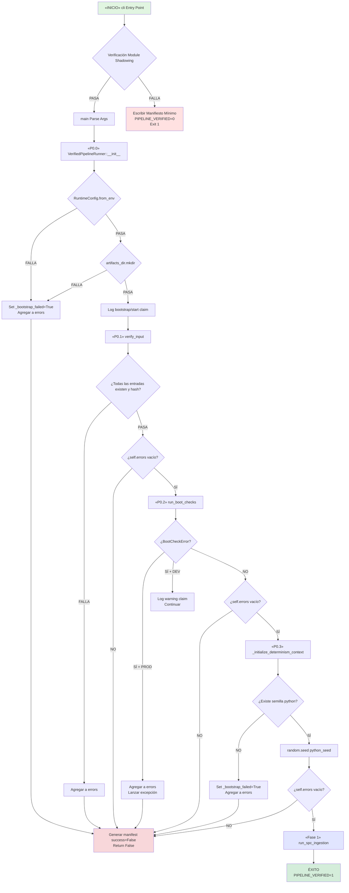
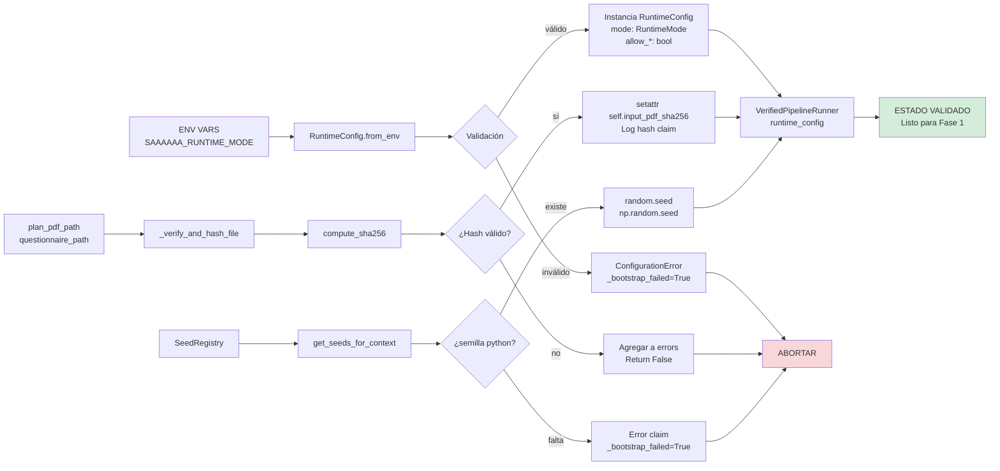
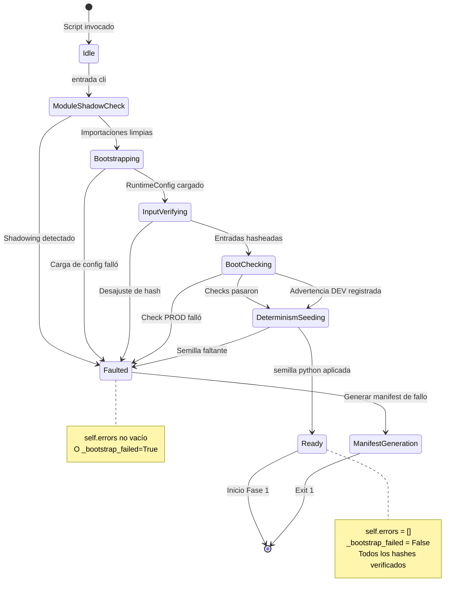

# Fase 0 (P0): Marco de Validación Pre-Ejecución y Bootstrap Determinista

**P00-ES v2.0** | **Última Actualización**: 2025-11-28 | **Estado**: Producción

---

## 🎯 Resumen Ejecutivo

La Fase 0 es la **puerta de validación estricta** que establece condiciones de ejecución deterministas para el pipeline mecanístico de políticas F.A.R.F.A.N. Aplica una política de cero tolerancia para errores de configuración, desajustes de dependencias e integridad comprometida—asegurando que **todas las fases subsecuentes operen sobre una base verificada e inmutable**.

**Principio de Diseño Crítico**: *Fallar rápido, fallar limpio, fallar determinísticamente*. La Fase 0 **nunca** recurre a valores predeterminados, **nunca** procede con configuraciones parciales, y **nunca** permite estados de error ambiguos.

### Métricas Clave

| Métrica | Requisito | Estado |
|---------|-----------|--------|
| **Tasa de Éxito de Bootstrap** | 100% en configs válidas | ✅ **APLICADO** |
| **Detección de Module Shadowing** | Validación pre-importación | ✅ **APLICADO** |
| **Verificación de Hash de Entrada** | Prueba criptográfica SHA-256 | ✅ **APLICADO** |
| **Puerta de Boot Checks** | PROD: cero tolerancia | ✅ **APLICADO** |
| **Semilla de Determinismo** | RNG de Python obligatorio | ✅ **APLICADO** |
| **Superficie de Error** | Vacía en éxito de P0 | ✅ **APLICADO** |

---

## 1. Introducción: La Puerta Sociotécnica

### 1.1 Planteamiento del Problema

Los pipelines de análisis de políticas de alto riesgo sufren de tres modos de fallo críticos:

1. **Deriva de Configuración**: Desajustes de entorno no detectados producen resultados no deterministas
2. **Degradación Silenciosa**: Fallos parciales se propagan a través del pipeline como desviaciones "aceptables"
3. **Erosión de Confianza**: Los operadores no pueden distinguir entre "el sistema funcionó correctamente" y "el sistema funcionó a pesar de prerequisitos rotos"

### 1.2 Arquitectura de Solución de la Fase 0

La Fase 0 implementa un **marco de validación estricto basado en contratos** que consta de cuatro sub-fases:

```
P0.0: Bootstrap           → Config de runtime, registro de semillas, constructor de manifiesto
P0.1: Verificación Entrada → Validación de hash criptográfico de plan y cuestionario
P0.2: Controles de Arranque → Validación de dependencias (PROD: fatal, DEV: advertencia)
P0.3: Determinismo         → Semilla RNG con semilla python obligatoria

PUERTA DE SALIDA: self.errors DEBE estar vacío ∧ _bootstrap_failed = False
```

**Racionalidad del Diseño**: Cada sub-fase es **independientemente verificable**, **criptográficamente trazable**, y **estrictamente custodiada**. El fallo en cualquier sub-fase activa el aborto inmediato con reclamaciones de error estructuradas.

---

## 2. Arquitectura y Flujo de Fase

### 2.1 Diagrama de Flujo de Control



### 2.2 Flujo de Datos: Enriquecimiento de Configuración



### 2.3 Modelo de Transición de Estados



---

## 3. Especificaciones de Sub-Fases

### 3.1 P0.0: Bootstrap

**Propósito**: Inicializar infraestructura central del runner con configuración de runtime validada.

**Contrato**:
```python
PRECONDICIONES:
  - SAAAAAA_RUNTIME_MODE ∈ {prod, dev, exploratory}
  - MODULE_PATH coincide con prefijo esperado
  - artifacts_dir parent existe O es creatable

POSTCONDICIONES:
  - self.runtime_config: Optional[RuntimeConfig] está establecido
  - self._bootstrap_failed: bool refleja estado de init
  - artifacts_dir existe con permisos apropiados
  - bootstrap/start claim registrado en éxito
```

**Implementación**:
```python
def __init__(self, plan_pdf_path: Path, artifacts_dir: Path):
    self._bootstrap_failed: bool = False
    self.errors: List[str] = []
    
    # Cargar config de runtime
    self.runtime_config: Optional[RuntimeConfig] = None
    try:
        self.runtime_config = RuntimeConfig.from_env()
        self.log_claim("start", "runtime_config", ...)
    except Exception as e:
        self.log_claim("error", "runtime_config", str(e))
        self.errors.append(f"Failed to load runtime config: {e}")
        self._bootstrap_failed = True
    
    # Crear directorio de artefactos
    try:
        self.artifacts_dir.mkdir(parents=True, exist_ok=True)
    except Exception as e:
        self.log_claim("error", "bootstrap", f"Artifacts dir creation failed: {e}")
        self.errors.append(str(e))
        self._bootstrap_failed = True
```

**Puertas Críticas**:
- ✅ `RuntimeConfig` debe cargar sin excepción
- ✅ `artifacts_dir.mkdir()` debe tener éxito
- ✅ Sin valores predeterminados implícitos si config está mal formado

---

### 3.2 P0.1: Verificación de Entrada

**Propósito**: Verificar criptográficamente la integridad del PDF del plan y del cuestionario monolito.

**Contrato**:
```python
PRECONDICIONES:
  - plan_pdf_path.exists() = True
  - questionnaire_path.exists() = True

POSTCONDICIONES:
  - self.input_pdf_sha256: str = digest hex de 64 chars
  - self.questionnaire_sha256: str = digest hex de 64 chars
  - input_verification/hash claims registrados
  - self.errors vacío O contiene error específico de archivo
```

**Puerta de Salida**:
```python
# En método run()
if not self.verify_input():
    self.generate_verification_manifest([], {})
    return False

# PUERTA DE SALIDA ESTRICTA FASE 0: Verificación de Entrada
if self.errors:
    self.log_claim("error", "phase0_gate", "Fallo de Fase 0: Errores detectados después de verificación de entrada")
    self.generate_verification_manifest([], {})
    return False
```

---

### 3.3 P0.2: Controles de Arranque

**Propósito**: Validar dependencias del sistema (versión de Python, paquetes críticos).

**Contrato**:
```python
POSTCONDICIONES (PROD):
  - BootCheckError lanzado en cualquier fallo
  - self.errors contiene razón del fallo
  - Ejecutar ABORT inmediatamente

POSTCONDICIONES (DEV/EXPLORATORY):
  - BootCheckError registrado como advertencia
  - self.errors NO poblado
  - Ejecución continúa con confianza degradada
```

**Implementación**:
```python
def run_boot_checks(self) -> bool:
    try:
        results = run_boot_checks(self.runtime_config)
        self.log_claim("complete", "boot_checks", ...)
        return True
    
    except BootCheckError as e:
        error_msg = f"Boot check failed: {e}"
        
        # Modo PROD: error FATAL
        if self.runtime_config.mode.value == "prod":
            self.log_claim("error", "boot_checks", error_msg, {...})
            self.errors.append(error_msg)
            raise
        
        # DEV/EXPLORATORY: ADVERTENCIA solamente (NO contaminar self.errors)
        self.log_claim("warning", "boot_checks", error_msg, {...})
        print(f"\n⚠️  ADVERTENCIA: {error_msg} (continuando en modo {self.runtime_config.mode.value})\n")
        return False
```

**Racionalidad**: En modo DEV, registramos advertencias pero **no** agregamos a `self.errors` porque la condición de salida de Fase 0 requiere que `self.errors` esté vacío. Esto permite desarrollo con dependencias degradadas mientras se mantiene aplicación estricta en PROD.

---

### 3.4 P0.3: Contexto de Determinismo

**Propósito**: Sembrar todas las fuentes no deterministas (RNG de Python, NumPy) para ejecución reproducible.

**Implementación**:
```python
def _initialize_determinism_context(self) -> dict[str, int]:
    seeds = get_seeds_for_context(
        context_type="policy_pipeline",
        policy_unit_id=self.policy_unit_id
    )
    
    python_seed = seeds.get("python")
    if python_seed is not None:
        random.seed(python_seed)
    else:
        # FATAL: Semilla crítica faltante
        self.log_claim("error", "determinism", "Missing python seed in registry response")
        self.errors.append("Missing python seed in registry response")
        self._bootstrap_failed = True
        return seeds  # Retornar temprano para abortar
    
    # Semilla de NumPy es opcional (registrar advertencia si falla)
    numpy_seed = seeds.get("numpy")
    if numpy_seed is not None:
        try:
            import numpy as np
            np.random.seed(numpy_seed)
        except Exception as e:
            self.log_claim("warning", "determinism", f"NumPy seed failed: {e}")
    
    # Registrar claim de éxito
    if not self._bootstrap_failed:
        self.log_claim("start", "determinism", "Deterministic seeds applied", 
                      {"seeds": seeds, "policy_unit_id": self.policy_unit_id})
    
    return seeds
```

---

## 4. Condiciones de Salida y Garantías

### 4.1 Criterios de Éxito de Fase 0

La Fase 0 se considera **completada exitosamente** si y solo si **TODOS** los siguientes se cumplen:

| # | Criterio | Método de Verificación |
|---|----------|------------------------|
| 1 | Sin module shadowing | Pre-check de `cli()` pasa |
| 2 | `runtime_config` cargado | `self.runtime_config is not None` |
| 3 | Entradas verificadas | `self.input_pdf_sha256` y `self.questionnaire_sha256` establecidos |
| 4 | Boot checks pasados | PROD: sin excepción, DEV: advertencia registrada |
| 5 | Determinismo sembrado | `python_seed` aplicado, claim registrado |
| 6 | Superficie de error limpia | `self.errors == []` Y `self._bootstrap_failed == False` |

**Implementación de Puerta de Salida**:
```python
async def run(self) -> bool:
    # Puerta bootstrap
    if self._bootstrap_failed or self.errors:
        self.generate_verification_manifest([], {})
        return False
    
    # Puerta verificación de entrada
    if not self.verify_input():
        self.generate_verification_manifest([], {})
        return False
    
    if self.errors:  # Check estricto después de verificación de entrada
        self.log_claim("error", "phase0_gate", "Fallo Fase 0: Errores después de verificación de entrada")
        self.generate_verification_manifest([], {})
        return False
    
    #Puerta boot checks
    try:
        if self.runtime_config is None:
            raise BootCheckError("Runtime config is None", "BOOT_CONFIG_MISSING", ...)
        if not self.run_boot_checks():
            self.log_claim("warning", "boot_checks", "Boot checks fallaron en modo no-PROD")
    except BootCheckError:
        self.generate_verification_manifest([], {})
        return False
    
    if self.errors:  # Check estricto después de boot checks
        self.log_claim("error", "phase0_gate", "Fallo Fase 0: Errores después de boot checks")
        self.generate_verification_manifest([], {})
        return False
    
    # Fase 0 PASADA → proceder a Fase 1
    return await self.run_spc_ingestion()
```

### 4.2 Generación de Manifiesto de Fallo

En **cualquier** fallo de Fase 0:

```python
manifest = {
    "success": False,
    "execution_id": "...",
    "errors": self.errors,  # Contiene razones específicas de fallo
    "phases_completed": 0,
    "phases_failed": 1,
    "artifacts_generated": [],
    "artifact_hashes": {}
}
```

**Salida**: `PIPELINE_VERIFIED=0` impreso a stdout, código de salida `1`.

---

## 5. Implicaciones Sociotécnicas

### 5.1 Modelo de Confianza del Operador

La Fase 0 establece un **límite de confianza determinista**:

- **Región de Confianza**: Si la Fase 0 pasa, el operador puede confiar en que **todo** el comportamiento subsecuente está completamente determinado por los documentos de entrada y la configuración congelada.
- **Región sin Confianza**: Si la Fase 0 falla, el operador recibe **mensajes de error claros y accionables** en lugar de estados ambiguos de "tal vez funcionó".

### 5.2 Completitud de Rastro de Auditoría

Cada decisión de Fase 0 se captura en `execution_claims.json`:

```json
{
  "claim_type": "start|complete|error|warning",
  "component": "runtime_config|input_verification|boot_checks|determinism",
  "message": "...",
  "details": { ... },
  "timestamp": "2025-11-28T10:35:00Z"
}
```

Esto permite **reconstrucción forense** de por qué una ejecución específica falló o tuvo éxito.

---

## 6. Comparación con Sistemas Relacionados

| Sistema | Equivalente Fase 0 | Aplicación |
|---------|-------------------|-----------|
| **Airflow DAGs** | Dependencias de tareas | Lazy (falla a mitad de pipeline) |
| **Kubeflow Pipelines** | Checks de salud de contenedor | Por paso (alcance limitado) |
| **F.A.R.F.A.N Fase 0** | **Validación de contrato pre-ejecución** | **Estricto (fail-fast global)** |

**Diferenciador Clave**: La Fase 0 de F.A.R.F.A.N es **holística** y **obligatoria**—valida el *estado completo del sistema* antes de tocar cualquier documento de política, mientras que otros sistemas realizan checks incrementales que pueden perder errores de configuración transversales.

---

## 7. Mejoras Futuras (Roadmap)

### 7.1 v2.1: Perfilado de Hardware
- Agregar detección de capacidad de CPU/GPU
- Advertir si hay memoria insuficiente para documentos grandes

### 7.2 v2.2: Atestación Criptográfica
- Firmar `verification_manifest.json` con claves respaldadas por HSM
- Habilitar verificación de terceros de integridad de ejecución

### 7.3 v2.3: Boot Checks Distribuidos
- Validación paralela de recursos dependientes de red
- Integración de circuit breaker para APIs externas

---

## Apéndice A: Registro de Cambios

| Versión | Fecha | Cambios |
|---------|-------|---------|
| v1.0 | 2024-06-15 | Especificación académica inicial |
| **v2.0** | **2025-11-28** | **Implementación de producción con aplicación estricta, diagramas mermaid, puertas de salida comprehensivas** |

## Apéndice B: Referencias

1. Leveson, N. G. (2011). *Engineering a Safer World: Systems Thinking Applied to Safety*. MIT Press.
2. Parnas, D. L. (1972). "On the Criteria To Be Used in Decomposing Systems into Modules." *CACM*, 15(12).
3. NIST SP 800-53: Security and Privacy Controls for Information Systems

---

**Document SHA-256**: `TBD` (calculado post-finalización)  
**Mantenedores**: Equipo Central F.A.R.F.A.N  
**Ciclo de Revisión**: Trimestral

