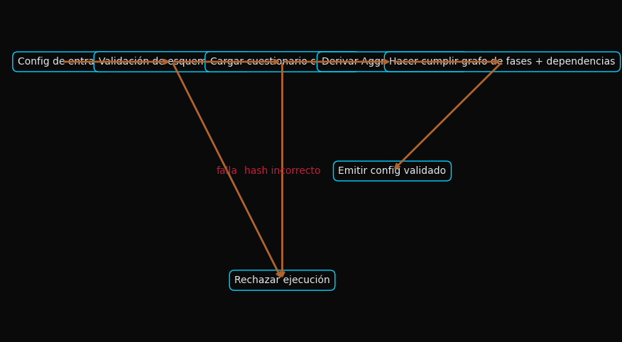
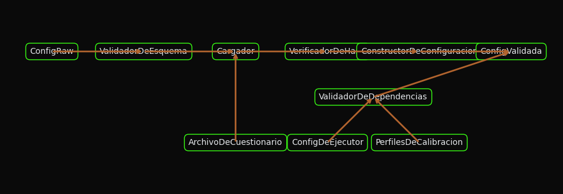
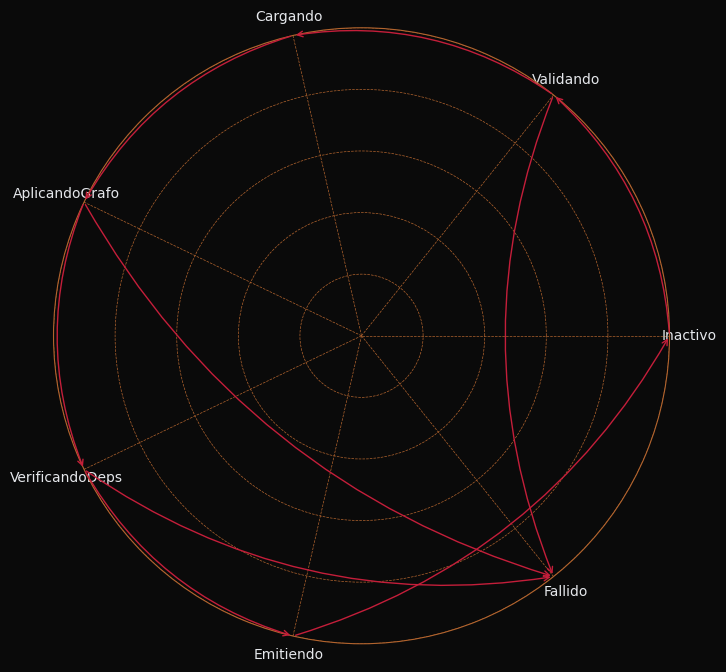
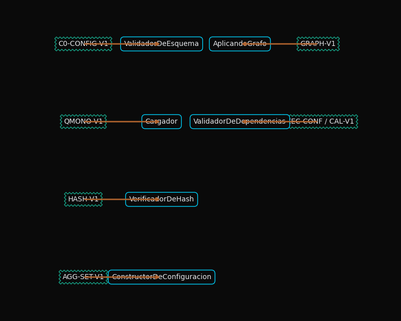

# Un Marco Sociotécnico para la Validación Pre-computacional en Tuberías de Políticas Mecanicistas

**P00-ES v1.0**

## Resumen
Este artículo describe el diseño y la función de la Fase 0 (N0), el nodo de validación inicial en la tubería de políticas mecanicistas F.A.R.F.A.N. La Fase 0 sirve como un punto de control sociotécnico crítico, asegurando la integridad, el determinismo y la fiabilidad de todo el sistema antes de que comiencen los procesos computacionales. Al imponer una serie de comprobaciones estrictas y automatizadas sobre la configuración, las dependencias y los activos centrales, esta fase actúa como una salvaguarda contra fallos sistémicos que de otro modo podrían propagarse a través de la tubería. Sostenemos que esta validación pre-computacional no es meramente un prerrequisito técnico, sino un elemento fundamental de un sistema sociotécnico bien diseñado, que fomenta la confianza, reduce la ambigüedad del operador y asegura que las interacciones humano-máquina posteriores se basen en un fundamento técnico estable y verificado.

## 1. Introducción

La tubería de políticas mecanicistas F.A.R.F.A.N. es un sistema complejo diseñado para ingerir, analizar y puntuar documentos de políticas. Los resultados de esta tubería están destinados a informar procesos de toma de decisiones de alto riesgo. Como tal, la fiabilidad y corrección del sistema son primordiales. Desde la perspectiva de la teoría de sistemas sociotécnicos, la tubería no es solo una colección de algoritmos y estructuras de datos; es un sistema donde los operadores humanos, analistas y tomadores de decisiones interactúan con un aparato técnico sofisticado. La calidad de estas interacciones, y por lo tanto la eficacia general del sistema, depende en gran medida de la estabilidad y previsibilidad del subsistema técnico.

La Fase 0 (N0) de la tubería está diseñada para establecer esta estabilidad. Es una puerta de enlace automatizada y no negociable que valida la configuración completa del sistema antes de que se inicie cualquier procesamiento específico de documentos. Esta fase operacionaliza el principio de "optimización conjunta" al asegurar que el sistema técnico se encuentre en un estado conocido y correcto, permitiendo así que el sistema social (los usuarios y operadores) interactúe con él de manera efectiva y con confianza. Al detectar errores de configuración, desajustes de dependencias o activos corruptos en la etapa más temprana posible, la Fase 0 previene la propagación de errores, que son costosos y erosionan la confianza, y que pueden resultar de un entorno técnico mal configurado. Este artículo detalla la metodología y los resultados de este marco de validación sociotécnica.

## 2. Metodología: Un Marco de Validación Sociotécnica

La metodología de la Fase 0 se basa en una serie de obligaciones contractuales que la configuración del sistema debe cumplir. Estos contratos se hacen cumplir a través de un flujo determinista y secuencial de pasos de validación.

### 2.1. Contratos de Entrada y Salida

El proceso de validación comienza con un **Contrato de Entrada**, que define el estado esperado del diccionario `config` que inicializa la tubería. Este contrato especifica las claves requeridas (`monolith_path`, `questionnaire_hash`, etc.), los tipos de datos y las precondiciones, como la inmutabilidad de los objetos de configuración y la corrección del grafo de fases definido. Las entradas prohibidas, como las referencias a componentes del sistema obsoletos o experimentales (por ejemplo, el nodo N2), se rechazan explícitamente.

Tras una validación exitosa, la Fase 0 produce un **Contrato de Salida**. Este no es simplemente un paso del insumo, sino un estado enriquecido y verificado. La salida incluye el cuestionario canónico cargado y verificado por hash, los `AggregationSettings` inicializados y un grafo de fases bloqueado, asegurando que el resto de la tubería opere sobre una base de datos consistente y confiable.

### 2.2. Flujo de Validación Interno

El flujo interno de la Fase 0 es una secuencia de sub-nodos de validación, cada uno responsable de un aspecto específico de la configuración del sistema:

1.  **Validación de Esquema:** El paso inicial verifica la presencia y los tipos correctos de todas las claves requeridas en el diccionario `config` de entrada.
2.  **Carga y Verificación del Cuestionario:** El cuestionario canónico, un activo de conocimiento central, se carga y su hash SHA-256 se verifica contra el valor en el `config`. Esto asegura la integridad e inmutabilidad de la lógica analítica central del sistema.
3.  **Aplicación del Grafo de Fases:** La ruta de ejecución de la tubería se valida para asegurar que solo contenga nodos activos y autorizados. Esto previene la ejecución de rutas de código experimentales u obsoletas.
4.  **Validación de Dependencias:** Se cargan y validan las configuraciones para los ejecutores, los perfiles de calibración y otras dependencies, asegurando que todos los componentes necesarios para la ejecución estén presentes y correctamente especificados.
5.  **Emisión:** El objeto de configuración completamente validado y enriquecido se almacena en caché en el contexto del orquestador, listo para las fases posteriores.

Este flujo estructurado asegura que el subsistema técnico esté "listo para el trabajo" antes de ser involucrado por el subsistema social, previniendo así una clase de errores que a menudo son difíciles de diagnosticar y que pueden socavar la confianza del usuario.

## 3. Resultados: Estado del Sistema y Cumplimiento del Contrato

La ejecución exitosa de la Fase 0 resulta en un estado inicial determinista y verificado para la tubería. La estructura de este proceso de validación se visualiza a través de una serie de grafos que representan el flujo de control, datos, transiciones de estado y vínculos contractuales.

### 3.1. Flujo de Control y Flujo de Datos

El **Grafo de Flujo de Control** ilustra la lógica de toma de decisiones de la Fase 0, mostrando cómo una configuración de entrada es validada y emitida, o rechazada en caso de fallo. El **Grafo de Flujo de Datos** muestra cómo los datos de configuración sin procesar son transformados y aumentados por una serie de validadores y constructores para producir el objeto de configuración final y validado.

### 3.2. Transición de Estado y Vínculos Contractuales

El **Grafo de Transición de Estado** modela el estado del propio nodo de la Fase 0, pasando de `Idle` a `Validando` y luego a `Faulted` o `Emitting`. Esto proporciona un modelo claro del ciclo de vida del nodo. El **Grafo de Vínculos Contractuales** visualiza cómo cada paso en el proceso de validación se rige por un contrato versionado específico (por ejemplo, `C0-CONFIG-V1`, `QMONO-V1`), asegurando que la lógica de validación en sí misma sea modular y mantenible.

### 3.3. Restricciones de Complejidad

El diseño de la Fase 0 está intencionadamente restringido para mantener una baja complejidad y una alta fiabilidad. Se compone de un máximo de seis sub-nodos con una profundidad de decisión no superior a cuatro. Esto asegura que el proceso de validación en sí mismo no sea una fuente de errores y pueda ser fácilmente comprendido y auditado.

## 4. Discusión: Manejo de Errores y Límites del Sistema

El marco de validación de la Fase 0 tiene implicaciones significativas para la resiliencia sociotécnica de la tubería F.A.R.F.A.N.

### 4.1. Manejo Proactivo de Errores

La estrategia de manejo de errores de la Fase 0 es proactiva y estricta. Por ejemplo, un desajuste del hash o una dependencia faltante resulta en un aborto inmediato y limpio de la ejecución, con un mensaje claro para el operador. El sistema evita deliberadamente recurrir a configuraciones por defecto o "mejor suposición". Desde un punto de vista sociotécnico, esta elección de diseño es crítica. Reduce la ambigüedad para el operador humano y evita que el sistema entre en un estado indeterminado que podría llevar a resultados difíciles de interpretar. Esta previsibilidad construye confianza y refuerza el rol del operador como supervisor de un sistema determinista, en lugar de ser un solucionador de problemas de uno caótico.

### 4.2. Definición de los Límites del Sistema

La Fase 0 juega un papel crucial en la definición de los límites entre el sistema F.A.R.F.A.N. y su entorno. El **Contrato Upstream** requiere que el mecanismo de invocación externo (por ejemplo, un CLI o API) proporcione una configuración inmutable. Esto previene modificaciones indeseables "a mitad de ejecución" que podrían violar las suposiciones de la tubería. El **Contrato Downstream** garantiza que la siguiente fase (N1, Ingestión de Documentos) reciba una configuración completamente validada. Estos límites explícitos crean una clara separación de responsabilidades, que es una característica de los sistemas bien diseñados y mantenibles.

## 5. Conclusión

La Fase 0 de la tubería F.A.R.F.A.N. es más que una simple comprobación de configuración. Es un sistema de control sociotécnico cuidadosamente diseñado que establece una base de confianza y fiabilidad para todas las operaciones posteriores. Al aplicar una metodología de validación rigurosa y basada en contratos, asegura la "optimización conjunta" de los componentes técnicos y sociales de la tubería. Se garantiza que el sistema técnico esté en un estado correcto y determinista, mientras que el sistema social de operadores y analistas está protegido de la ambigüedad y el potencial de error que surge de una configuración no validada. Este enfoque demuestra que un enfoque en el estado inicial y los límites de un sistema computacional complejo es una inversión crítica en su éxito y utilidad generales.

## Referencias
*(Espacio reservado para futuras citas)*

## Apéndice: Gestión de Cambios
- Cualquier nuevo campo de configuración debe reflearse en este documento y en su contraparte en inglés.
- Los cambios en la política de hashing o en la inicialización de `AggregationSettings` requieren un incremento de la versión de este documento (por ejemplo, `P00-ES_v1.1`).
