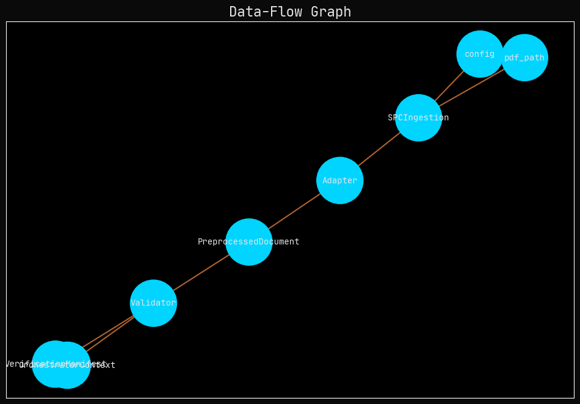

# P01-EN v1.0: A Sociotechnical Framework for Deterministic Policy Document Ingestion

## 1. Abstract

This document outlines the architecture and formal contracts of the N1 canonical node, the first operational phase of the F.A.R.F.A.N. mechanistic policy pipeline. The N1 node is responsible for the deterministic ingestion of Canonical Policy Packages (CPPs), transforming them into a structured `PreprocessedDocument` containing exactly 60 Smart Policy Chunks (SPCs). By conceptualizing this pipeline as a sociotechnical system, we emphasize the critical interplay between its computational components (code, infrastructure) and its social components (analysts, policymakers, legal frameworks). This approach ensures that the system is not only technically robust but also aligned with the complex human context in which it operates. The N1 node's design guarantees referential integrity, deterministic output, and verifiable compliance through a series of explicit input, output, and processing contracts.

## 2. Introduction

The analysis of public policy documents presents a significant challenge for computational systems. These documents are complex, semi-structured artifacts that encode legal, social, and political intent. Traditional natural language processing pipelines often struggle to maintain determinism and traceability, making their outputs difficult to audit and trust. The F.A.R.F.A.N. project addresses this challenge by implementing a mechanistic, contract-driven pipeline that ensures every stage of processing is verifiable and reproducible.

This paper details the first phase of this pipeline, the N1 ingestion node. We adopt a sociotechnical systems theory lens to frame our design. This theory posits that any effective system is a product of the interaction between its technical and social subsystems. In our context, the "technical" refers to the Python code, data structures, and validation logic, while the "social" encompasses the policy experts who create the source documents, the analysts who interpret the system's outputs, and the legal standards that govern the policy domain. The N1 node is therefore designed not merely as a data processing script but as a critical institutional mechanism for standardizing unstructured policy data into a machine-readable format that respects and preserves its original semantic intent.

The primary contribution of this work is the formalization of the ingestion process as a series of immutable contracts, ensuring that the transformation from a raw PDF to a `PreprocessedDocument` is deterministic and auditable. This foundational step is critical for the downstream analytical phases, which rely on the structural integrity of the 60 canonical SPCs generated by this node.

## 3. System Architecture and Methodology

The N1 node operates as a discrete, stateless function within the broader F.A.R.F.A.N. orchestration engine. Its architecture is defined by a series of contracts that govern its inputs, internal flow, and outputs, ensuring predictable behavior and seamless integration with upstream and downstream components.

### 3.1. Canonical Node Summary
- **Node ID:** N1
- **Upstream:** N0 (Validated Configuration) + Raw PDF Input
- **Downstream:** N3 (Micro Question Execution) via `PreprocessedDocument`
- **Purpose:** To transform a Canonical Policy Package (CPP) into a chunked `PreprocessedDocument` containing exactly 60 Smart Policy Chunks (SPCs) and all metadata required for deterministic analysis.

### 3.2. Internal Flow
The internal process is a five-step pipeline that ensures each document is handled consistently:
1.  **CPP Ingestion:** The system runs the SPC ingestion pipeline to produce a `CanonPolicyPackage`.
2.  **Adapter Step:** A dedicated adapter converts the `CanonPolicyPackage` into a `PreprocessedDocument`, extracting and normalizing chunks, metadata, and indices.
3.  **Validation:** The system validates the `PreprocessedDocument` against its schema, ensuring chunk count, graph integrity, and non-empty text fields.
4.  **Context Recording:** Ingestion metadata is stored in a Verification Manifest for auditability.
5.  **Emission:** The validated `PreprocessedDocument` is returned to the orchestrator's context for downstream processing.

### 3.3. Complexity Constraints
To maintain modularity and prevent architectural decay, the N1 node adheres to strict complexity limits:
- **Subnodes:** Maximum of 5 (ingestion, adapter, validator, manifest recorder, emission).
- **Decision Depth:** No more than 3 conditional branches.
- **Coupling:** Tightly coupled only to the SPC pipeline, the adapter, the verification manifest, and the orchestrator context.

## 4. Verification and Validation (Results)

The reliability of the N1 node is guaranteed by a set of formal contracts that function as its operational specification. These contracts are not merely documentation; they are enforced at runtime and serve as the ground truth for the system's behavior.

### 4.1. Input Contract
- **Route:** `process_development_plan_async(pdf_path, preprocessed_document=None, config)`
- **Required Inputs:**
    - `pdf_path`: A string pointing to the canonical source file.
    - `config`: A validated configuration object from the N0 node.
- **Preconditions:**
    - The PDF must be accessible and its checksum recorded.
    - The SPC adapter version must be pinned and the chunking strategy declared as "semantic."
- **Forbidden Inputs:** Partially parsed payloads, documents without policy metadata, and references to experimental adapters.

### 4.2. Output Contract
- **Type:** A `PreprocessedDocument` dataclass.
- **Postconditions:**
    - The output must contain exactly 60 SPC chunks, each tagged with a `policy_area_id` and `dimension_id`.
    - The metadata must report `chunk_count == 60` and `processing_mode == "chunked"`.

### 4.3. Error Handling
The system is designed to fail fast and explicitly upon contract violation:
- Exceptions from the SPC pipeline or adapter are treated as fatal and cause the run to be rejected.
- Empty text or zero chunks trigger a `ValueError`.
- Missing `policy_area_id` or `dimension_id` metadata in any chunk leads to an abort with a detailed diagnostic entry.

## 5. Visualizations

The following diagrams illustrate the architecture and logic of the N1 node, rendered in the aesthetic of the Atroz dashboard to provide a cohesive visual language for the F.A.R.F.A.N. project.

### 5.1. Control-Flow Graph
This graph shows the sequential logic of the N1 node, highlighting the main processing path and the single point of failure.

### 5.2. Data-Flow Graph
This graph illustrates how data objects are passed between the components of the N1 node, from the initial PDF and configuration to the final `PreprocessedDocument` and Verification Manifest.

### 5.3. State-Transition Graph
This diagram models the possible states of the N1 node during its execution, from "Idle" to "Emitting," including the "Faulted" state that results from a contract violation.

### 5.4. Contract-Linkage Graph
This graph shows the relationships between the formal contracts and the system components they govern, emphasizing the contract-driven nature of the architecture.

## 6. Discussion

The design of the N1 node reflects a deliberate application of sociotechnical systems theory. The rigid, contract-driven architecture is a direct response to the social need for trust and auditability in policy analysis. By enforcing determinism at the point of ingestion, we build a foundation of reliability that persists throughout the pipeline. The "60 chunks" requirement is not arbitrary; it is a socially negotiated standard that balances analytical granularity with cognitive tractability for human analysts.

This design choice has several implications. First, it forces a clear separation of concerns between the technical task of parsing and the social task of defining analytical categories (policy areas and dimensions). Second, it makes the system's behavior legible to all stakeholders, from developers to policy experts. The Verification Manifest, for example, serves as a boundary object that translates technical execution details into a socially meaningful record of compliance.

However, this rigidity also introduces constraints. The system is intentionally inflexible regarding the chunk count and structure. Any deviation from the canonical 60 SPCs is treated as a critical error. This trade-off—sacrificing flexibility for predictability—is a core tenet of the F.A.R.F.A.N. project's philosophy, prioritizing institutional robustness over ad-hoc analytical freedom.

## 7. Conclusion

The N1 ingestion node is a critical component of the F.A.R.F.A.N. mechanistic policy pipeline. By framing its design through a sociotechnical lens, we have developed a system that is not only technically sound but also socially aware. Its contract-driven architecture ensures that the initial transformation of unstructured policy documents into structured, analyzable data is deterministic, verifiable, and aligned with the overarching goals of transparency and trust.

Future work will focus on the downstream analytical nodes (N3 and beyond), which will consume the `PreprocessedDocument` generated by N1. The foundational determinism established in this phase is the precondition for the more complex semantic and quantitative analyses that follow. The principles of contract-driven design and sociotechnical alignment will continue to guide the development of the entire F.A.R.F.A.N. pipeline.

## 8. Change Management

- Any change to the chunk count, adapter behavior, or SPC pipeline requires updating this document, its Spanish version, and incrementing the version label (e.g., `P01-EN_v1.1`).
- The addition of new attributes to the `PreprocessedDocument` must be reflected in its schema contract.
