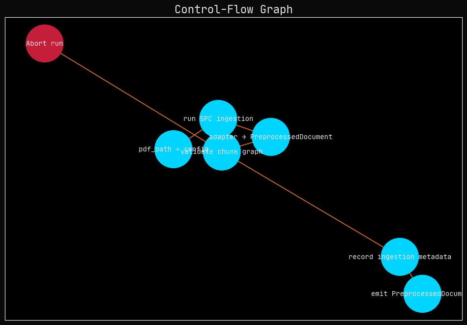
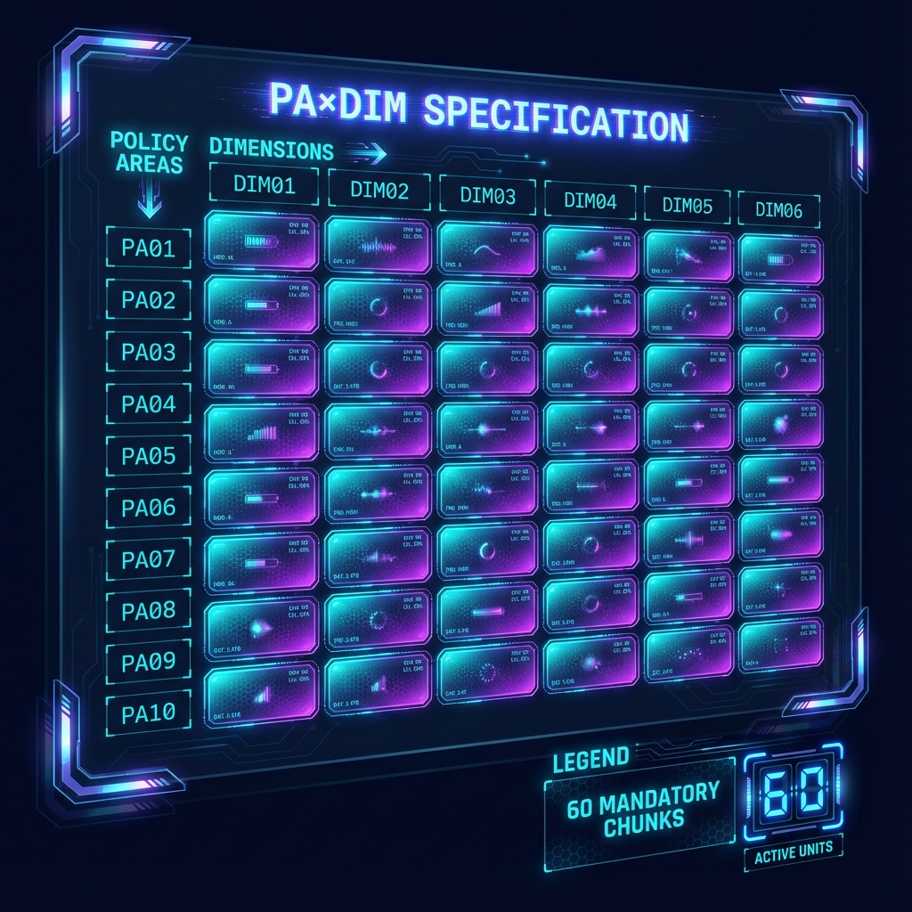
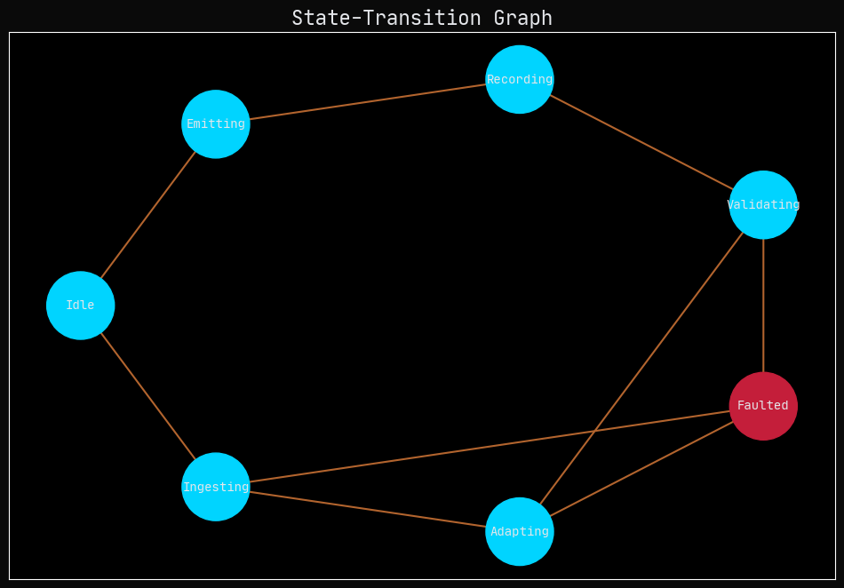
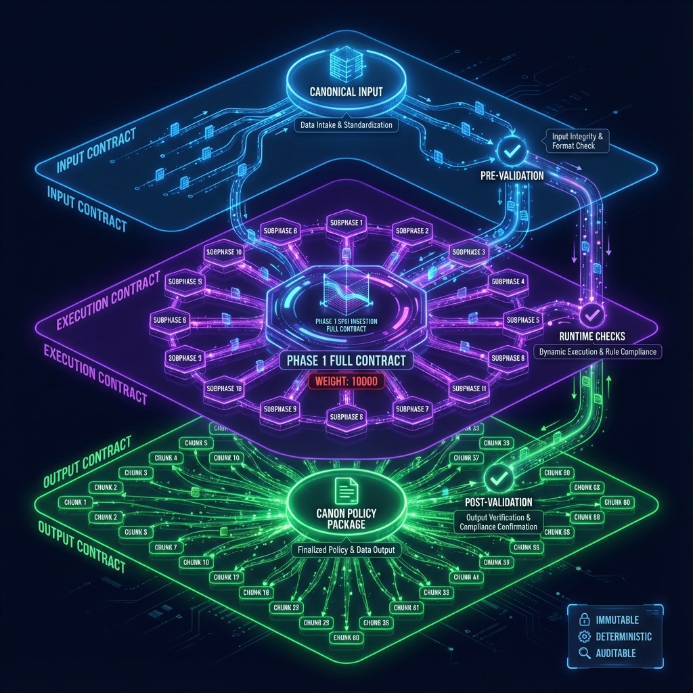

# P01-EN v2.0: Strict Execution Contract for SPC Ingestion (Phase 1)

## 1. Executive Summary

This document specifies the architecture and immutable contracts of the **Canonical Node N1 (Phase 1)** of the F.A.R.F.A.N. pipeline. Node N1 has been refactored to operate under a **Strict Execution Contract (Weight: 10000)**, guaranteeing zero ambiguity and total determinism.

**Critical Mission**: Transform a `CanonicalInput` into a `CanonPolicyPackage` (CPP) containing **EXACTLY 60 Smart Policy Chunks (SPCs)**, distributed in a perfect matrix of 10 Policy Areas × 6 Dimensions. Any deviation results in immediate pipeline termination.

## 2. Contract Specification (Full Contract)

### 2.1. PA×DIM Grid (60 Chunks)

The system must produce complete coverage of the following matrix:

| Dimensions (6) | PA01 | PA02 | PA03 | PA04 | PA05 | PA06 | PA07 | PA08 | PA09 | PA10 |
|---|---|---|---|---|---|---|---|---|---|---|
| **DIM01** (Inputs) | ✓ | ✓ | ✓ | ✓ | ✓ | ✓ | ✓ | ✓ | ✓ | ✓ |
| **DIM02** (Activities) | ✓ | ✓ | ✓ | ✓ | ✓ | ✓ | ✓ | ✓ | ✓ | ✓ |
| **DIM03** (Outputs) | ✓ | ✓ | ✓ | ✓ | ✓ | ✓ | ✓ | ✓ | ✓ | ✓ |
| **DIM04** (Outcomes) | ✓ | ✓ | ✓ | ✓ | ✓ | ✓ | ✓ | ✓ | ✓ | ✓ |
| **DIM05** (Impacts) | ✓ | ✓ | ✓ | ✓ | ✓ | ✓ | ✓ | ✓ | ✓ | ✓ |
| **DIM06** (Causality) | ✓ | ✓ | ✓ | ✓ | ✓ | ✓ | ✓ | ✓ | ✓ | ✓ |

**Total**: 60 Mandatory Chunks.

### 2.2. 16-Subphase Architecture

Processing follows a strict sequence of 16 subphases (SP0-SP15):

1.  **SP0 - Language Detection**: Language validation (ES).
2.  **SP1 - Advanced Preprocessing**: Unicode NFC normalization.
3.  **SP2 - Structural Analysis**: Hierarchical decomposition.
4.  **SP3 - Knowledge Graph**: Base graph construction.
5.  **SP4 - PA×DIM Segmentation** [CRITICAL]: Generation of the 60-chunk matrix.
6.  **SP5 - Causal Chain Extraction**: Identification of causal chains.
7.  **SP6 - Causal Integration**: Fusion of causal graphs.
8.  **SP7 - Argumentative Analysis**: Argument extraction.
9.  **SP8 - Temporal Analysis**: Temporal markers.
10. **SP9 - Discourse Analysis**: Discursive modes.
11. **SP10 - Strategic Integration**: Strategic fusion.
12. **SP11 - Smart Chunk Generation** [CRITICAL]: Creation of SmartChunk objects.
13. **SP12 - Inter-Chunk Enrichment**: Signal irrigation.
14. **SP13 - Integrity Validation** [CRITICAL]: Invariant verification.
15. **SP14 - Deduplication**: Final cleanup.
16. **SP15 - Strategic Ranking**: Final ordering.

## 3. System Visualization (ATROZ Dashboard)

### 3.1. Control Flow (Execution Trace)

The following diagram shows the strict execution sequence and critical failure points.



### 3.2. PA×DIM Grid Specification

Visualization of the mandatory 60-cell data structure.



### 3.3. Execution States

Allowed state transitions during contract execution.



### 3.4. Contract Linkage

Relationship between input, execution, and output contracts.



## 4. Invariants and Failure Handling

The system operates under a **"Loud Failure"** policy. Partial recovery does not exist.

```python
class Phase1FatalError(Exception):
    """Irrecoverable fatal error in Phase 1."""
    pass
```

**Verified Invariants:**
1.  `chunk_count == 60`
2.  `subphases_executed == 16`
3.  `pa_dim_coverage == "COMPLETE"`
4.  `execution_trace` complete and cryptographically verified.

## 5. Change Management

- **v2.0**: Complete refactor to Strict Execution Contract (16 subphases, 60 chunks).
- **v1.0**: Legacy version (deprecated).
