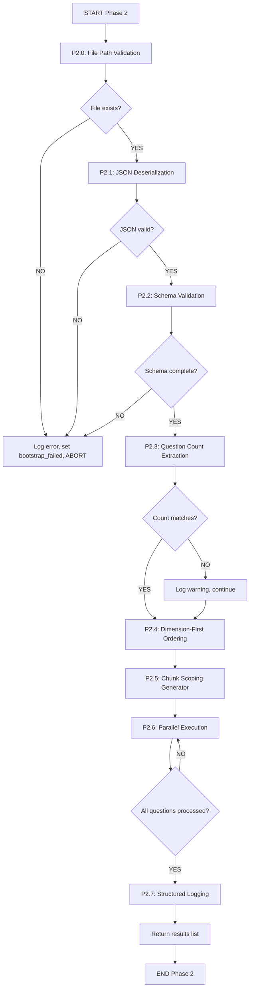
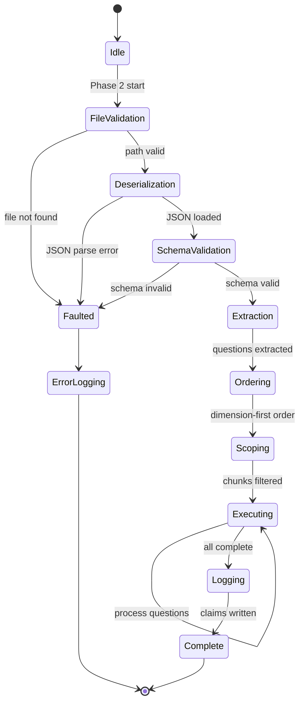
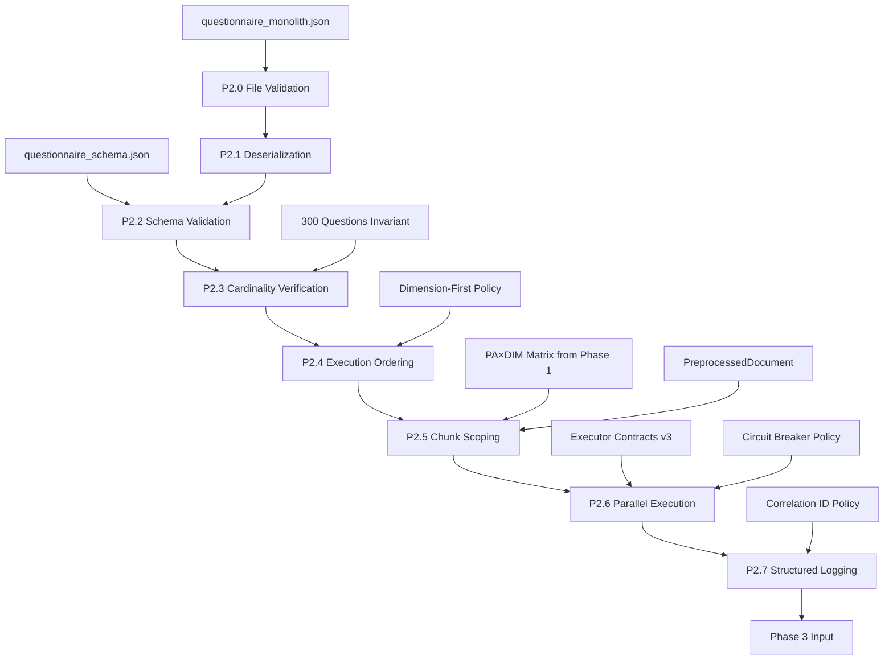

# P02-EN v2.0 — Phase 2 (Questionnaire Extraction & Micro Question Execution) Complete Specification

## Canonical Node Summary
- **Node ID:** N2  
- **Upstream:** N1 (SPC Ingestion), N0 (Configuration Bootstrap)  
- **Downstream:** N3 (Micro Scoring)  
- **Purpose:** Load and validate the canonical questionnaire monolith, extract all micro questions with metadata integrity, establish cardinality invariants for downstream phases, and execute the granular interrogation of the policy document using a deterministic dimension-first approach with strict data scoping.

## Phase Definition

Phase 2 operates as a two-stage pipeline combining questionnaire extraction (subphases P2.0-P2.3) with micro question execution (subphases P2.4-P2.7). The extraction stage establishes the canonical question inventory that defines pipeline cardinality, while the execution stage performs the actual policy analysis using dimension-first ordering and hermetic chunk scoping.

## Input Contract
- **Route:** `PreprocessedDocument` from N1 with exactly 60 Smart Policy Chunks, `RuntimeConfig` from N0 with validated environment settings, questionnaire file path from canonical location at `system/config/questionnaire/questionnaire_monolith.json`.
- **Format:** `PreprocessedDocument` containing `chunks` list with PA×DIM metadata tags on each chunk, JSON file path as Path object or string.
- **Preconditions:**
  - Questionnaire file exists at canonical location and is readable.
  - `PreprocessedDocument.chunks` list contains exactly 60 entries verified by Phase 1.
  - Each chunk has non-null `policy_area_id` in range PA01-PA10 and `dimension_id` in range DIM01-DIM06.
  - RuntimeConfig loaded successfully with valid mode setting.
- **Forbidden inputs:** Non-existent questionnaire paths, chunks missing PA or DIM tags, document with chunk count not equal to 60, mutated chunks after Phase 1 validation.

## Output Contract
- **Type:** List[`MicroQuestionRun`] containing exactly 300 entries.
- **Fields:** Each `MicroQuestionRun` contains `question_id`, `question_global`, `base_slot`, `metadata` dict with PA/DIM/cluster/modality, `evidence` object or None, `error` string or None, `duration_ms` float, `aborted` boolean.
- **Postconditions:** Question count equals 300 verified against extracted inventory, all questions executed in dimension-first order, each question received only chunks matching its target PA and DIM, execution trace logged with correlation identifiers, circuit breaker states recorded for all base slots.

## Subphase Architecture

Phase 2 execution follows eight sequential subphases divided into two logical stages. The extraction stage (P2.0-P2.3) establishes the canonical question inventory and validates structural integrity, while the execution stage (P2.4-P2.7) performs the actual micro question processing with strict isolation guarantees.

### P2.0: Questionnaire File Path Validation

This subphase verifies the existence and accessibility of the canonical questionnaire monolith file before attempting any I/O operations. File path validation prevents downstream failures by catching configuration errors at the earliest possible point in the pipeline.

The orchestrator first constructs the canonical file path by joining the project root directory with the relative path segments for system configuration and questionnaire storage. The path construction uses Path object operations to ensure cross-platform compatibility and resolve any symbolic links to their actual filesystem locations. Once the canonical path is resolved, the subphase checks file existence by invoking the Path exists method which queries the filesystem without opening the file. If the exists check returns False, the subphase immediately logs an error claim with component identifier input_verification and context field file_path containing the attempted path string, then appends a descriptive error message to the orchestrator errors list stating that the questionnaire file was not found at the canonical location, and finally sets the bootstrap_failed flag to True to trigger Phase 0 exit gate logic. If the exists check returns True, the subphase proceeds to verify file readability by checking permission bits through Path stat method and validating that the current process has read access. Any permission errors trigger the same error handling sequence with appropriate error messages describing the permission denial. Upon successful path and permission validation, the subphase logs a start claim with component questionnaire_load and attaches the verified file path to the orchestrator state for use in subsequent subphases.

**Atomic Operations:**
1. Construct canonical path using PROJECT_ROOT joined with system config questionnaire subdirectory and questionnaire_monolith.json filename.
2. Invoke Path.exists() method on constructed path and capture boolean result.
3. If exists returns False, log error claim with type error and component input_verification, append file not found message to orchestrator errors list, set bootstrap_failed to True, and return early from subphase.
4. Invoke Path.stat() method to retrieve file metadata including permission bits.
5. Check permission bits for read access by current process user and group.
6. If read permission absent, log error claim with permission denied message, append to errors list, set bootstrap_failed flag, return early.
7. Log start claim with component questionnaire_load and details containing verified file path.
8. Store verified Path object in orchestrator state variable questionnaire_file_path for consumption by P2.1.

**Type Checks:**
- Assert questionnaire_file_path is instance of Path before invoking exists method.
- Assert stat result is FileStats or equivalent platform type before accessing permission attributes.
- Assert orchestrator errors is list type before appending strings.
- Assert bootstrap_failed is boolean type before assignment.

**Error Messages:**
- "Questionnaire file not found at canonical location: {file_path}" when exists check fails.
- "Questionnaire file exists but is not readable: {file_path}, permissions: {perms}" when permission check fails.
- "Invalid questionnaire path type: expected Path, got {type}" when path construction produces non-Path object.

**Integration Points:**
- Consumes PROJECT_ROOT from farfan_pipeline.config.paths module.
- Produces questionnaire_file_path consumed by P2.1 JSON deserialization.
- Produces bootstrap_failed flag checked by Phase 0 exit gate in core orchestrator run method.
- Produces error messages appended to orchestrator errors list checked by all phase gates.

### P2.1: JSON Deserialization with Exception Handling

This subphase loads the questionnaire file contents into memory and parses the JSON structure, implementing comprehensive error handling with specific exception types and deterministic re-raise logic. JSON deserialization is a critical failure point where malformed files, encoding issues, or resource exhaustion can occur, requiring precise error classification for diagnostic purposes.

The subphase begins by opening the questionnaire file using a context manager that ensures file handle cleanup regardless of success or failure. The open call specifies explicit encoding as utf-8 to handle international characters in policy text and sets buffering to default system values for optimal I/O performance. Inside the context manager, the subphase reads the entire file contents into a string variable using the read method without chunking, which is acceptable because questionnaire files are bounded at approximately 20MB and modern systems have sufficient memory. After capturing file contents, the subphase computes a SHA-256 hash of the byte-encoded string for integrity verification in later subphases and stores the hash in orchestrator state. The subphase then invokes json.loads on the content string, wrapping the call in a try-except block that catches JSONDecodeError specifically. If JSONDecodeError is raised, the exception handler logs an error claim with component questionnaire_parse and details containing the exception message, line number, and column number from the exception object, then appends a formatted error string to the orchestrator errors list stating that JSON parsing failed with the specific syntax location, sets bootstrap_failed to True, and re-raises the JSONDecodeError with a chained exception context to preserve the original stack trace. If json.loads succeeds, it returns a dictionary object that the subphase assigns to a variable questionnaire_data and passes to P2.2 for schema validation. The subphase also handles unexpected exceptions like UnicodeDecodeError for encoding issues and MemoryError for resource exhaustion, each with distinct error messages and re-raise behavior.

**Atomic Operations:**
1. Invoke Path.open() on questionnaire_file_path from P2.0 with mode equals r and encoding equals utf-8 to get file handle.
2. Inside context manager, invoke file_handle.read() to capture entire contents as string.
3. Encode content string to bytes using utf-8 and pass to hashlib.sha256() to compute digest.
4. Store hex representation of hash digest in orchestrator state variable questionnaire_content_hash.
5. Wrap json.loads(content_string) in try-except block catching JSONDecodeError as exception variable.
6. In JSONDecodeError handler, extract msg, lineno, and colno attributes from exception object.
7. Log error claim with component questionnaire_parse and details dict containing error message and position.
8. Append formatted string to orchestrator errors list with template "Failed to parse questionnaire JSON at line {lineno} column {colno}: {msg}".
9. Set orchestrator bootstrap_failed flag to True.
10. Re-raise JSONDecodeError using raise statement without arguments to preserve stack trace.
11. If json.loads succeeds, assign returned dict to questionnaire_data variable.
12. Wrap steps in outer try-except catching UnicodeDecodeError with distinct handler logging encoding error and re-raising.
13. Wrap in outermost try-except catching MemoryError with handler logging resource exhaustion and re-raising.
14. Return questionnaire_data dict to caller for P2.2 consumption.

**Type Checks:**
- Assert questionnaire_file_path from P2.0 is Path instance before invoking open.
- Assert content_string after read is str type before passing to json.loads.
- Assert hash digest is bytes type before invoking hex method.
- Assert questionnaire_data after json.loads is dict type before returning.
- Assert exception object in JSONDecodeError handler has lineno and colno integer attributes.

**Error Messages:**
- "Failed to parse questionnaire JSON at line {lineno} column {colno}: {msg}" when JSONDecodeError caught.
- "Questionnaire file contains invalid UTF-8 encoding: {unicode_error}" when UnicodeDecodeError caught.
- "Insufficient memory to load questionnaire file of size {file_size} bytes" when MemoryError caught.
- "Questionnaire file handle closed unexpectedly during read operation" when IOError caught.

**Integration Points:**
- Consumes questionnaire_file_path Path object from P2.0.
- Produces questionnaire_data dict consumed by P2.2 schema validation.
- Produces questionnaire_content_hash string consumed by P2.6 integrity verification.
- Produces error messages appended to orchestrator errors list checked by phase gates.
- Produces bootstrap_failed flag checked by Phase 0 exit gate.

### P2.2: Question Dictionary Schema Validation

This subphase validates the structure and completeness of the questionnaire dictionary, ensuring all mandatory top-level blocks exist and micro questions array contains required fields for downstream processing. Schema validation prevents silent failures from missing data by explicitly checking the questionnaire contract before questions are extracted.

The subphase begins by checking the presence of required top-level keys in the questionnaire_data dictionary received from P2.1. The required keys list includes canonical_notation, blocks, schema_version, version, generated_at, and integrity, representing the core structural elements that downstream code expects to access. The subphase iterates over the required keys using a list comprehension that checks each key using the in operator on the dictionary, collecting any missing keys into a missing_keys list. If the missing_keys list is non-empty, the subphase logs an error claim with component schema_validation and details containing the list of missing keys, appends a formatted error message to orchestrator errors list stating which top-level keys are absent, sets bootstrap_failed to True, and returns early from the subphase without proceeding to block validation. If all top-level keys are present, the subphase extracts the blocks dictionary from questionnaire_data and validates the presence of required block keys including macro_question, meso_questions, micro_questions, niveles_abstraccion, scoring, and semantic_layers. Missing block keys trigger the same error logging and early return sequence. For the micro_questions block specifically, the subphase performs additional validation by checking that the value is a list type and the list is non-empty. If micro_questions is not a list, the subphase logs a type error and returns early. If the list is empty, the subphase logs a cardinality error stating that zero questions were found when at least 300 are expected. The subphase then samples the first micro question dictionary from the list and validates the presence of mandatory question fields including question_id, question_global, base_slot, dimension_id, policy_area_id, cluster_id, and scoring_modality. Missing fields trigger an error log with the list of absent field names and the question index being validated. Upon successful validation of all schema requirements, the subphase logs a complete claim with component schema_validation and details containing the count of validated questions and blocks.

**Atomic Operations:**
1. Define required_top_keys list containing strings canonical_notation, blocks, schema_version, version, generated_at, integrity.
2. Iterate required_top_keys and collect into missing_top_keys list any key k where k not in questionnaire_data evaluates to True.
3. If missing_top_keys list length greater than zero, log error claim with component schema_validation and details dict with missing_keys field.
4. Append formatted string to orchestrator errors list with template "Missing required top-level keys in questionnaire: {keys_list}".
5. Set bootstrap_failed flag to True.
6. Return early from subphase function.
7. Extract blocks dict from questionnaire_data using subscript operator with key blocks.
8. Define required_block_keys list containing strings macro_question, meso_questions, micro_questions, niveles_abstraccion, scoring, semantic_layers.
9. Iterate required_block_keys and collect missing blocks using same pattern as step 2.
10. If missing blocks found, execute error logging sequence identical to steps 3-6 with appropriate message template.
11. Extract micro_questions value from blocks dict using subscript with key micro_questions.
12. Check if micro_questions is instance of list type using isinstance builtin.
13. If isinstance returns False, log error claim stating type mismatch with expected list and actual type, append to errors, set bootstrap_failed, return early.
14. Check if len(micro_questions) equals zero.
15. If zero length, log error claim with cardinality mismatch, append error message stating zero questions found, set bootstrap_failed, return early.
16. Extract first element from micro_questions list using subscript zero.
17. Define required_question_fields list containing question_id, question_global, base_slot, dimension_id, policy_area_id, cluster_id, scoring_modality.
18. Iterate required_question_fields collecting missing fields where field not in first_question.
19. If missing question fields found, log error claim with field names and question index, append to errors, set bootstrap_failed, return early.
20. Log complete claim with component schema_validation and details containing validated question count and block count.

**Type Checks:**
- Assert questionnaire_data from P2.1 is dict type before accessing keys.
- Assert blocks extracted from questionnaire_data is dict type before accessing block keys.
- Assert micro_questions is list type before checking length or accessing elements.
- Assert first_question is dict type before checking field presence.
- Assert question_id field if present is string type.
- Assert question_global field if present is integer type.

**Error Messages:**
- "Missing required top-level keys in questionnaire: {missing_keys}" when top-level validation fails.
- "Missing required blocks in questionnaire: {missing_blocks}" when block validation fails.
- "micro_questions must be a list, got {actual_type}" when type check fails.
- "micro_questions array is empty, expected at least 300 questions" when cardinality check fails.
- "Micro question at index 0 missing required fields: {missing_fields}" when question field validation fails.

**Integration Points:**
- Consumes questionnaire_data dict from P2.1 JSON deserialization.
- Produces validated blocks dict consumed by P2.3 question extraction.
- Produces bootstrap_failed flag checked by Phase 0 exit gate.
- Produces error messages appended to orchestrator errors list.

### P2.3: Question Count Extraction and Cardinality Verification

This subphase extracts the micro questions array from the validated questionnaire structure and verifies that the question count matches the expected cardinality of exactly 300 questions, establishing the invariant that downstream phases rely on for array sizing and iteration bounds. Question count verification is critical because Phase 8 assembly logic uses this cardinality to validate complete coverage of the 30 base slots times 10 policy areas analytical matrix.

The subphase begins by extracting the blocks dictionary from questionnaire_data using the subscript operator with key blocks, then extracts the micro_questions list from blocks using subscript operator with key micro_questions. The extraction assumes P2.2 validation has already confirmed these keys exist, so no additional existence checks are performed. The subphase then invokes the len builtin function on the micro_questions list to count the number of question dictionaries present. The count result is stored in a variable actual_question_count for comparison against the expected value. The subphase retrieves the expected question count from the EXPECTED_QUESTION_COUNT constant which defaults to 305 but includes 300 micro questions plus 4 meso questions plus 1 macro question, so the subphase uses a corrected expected value of 300 for micro questions specifically. The subphase compares actual_question_count to the expected value of 300 using the equality operator. If the comparison returns False indicating a mismatch, the subphase logs a warning claim with component cardinality_verification and details containing both the expected and actual counts, then appends a warning message to orchestrator state indicating potential incomplete question coverage but does not set bootstrap_failed because question count mismatches are treated as warnings rather than fatal errors to allow pipeline execution with partial question sets during development. If the comparison returns True indicating exact match, the subphase logs a complete claim with component cardinality_verification confirming that 300 questions were verified. The subphase then stores the micro_questions list in orchestrator state variable micro_questions_inventory for consumption by P2.4 execution ordering. Finally, the subphase extracts the question_global field from each question dictionary and stores the maximum value in orchestrator state variable max_question_global for use in progress tracking and correlation identifier generation during execution.

**Atomic Operations:**
1. Extract blocks dict from questionnaire_data using subscript operator with key blocks.
2. Extract micro_questions list from blocks dict using subscript with key micro_questions.
3. Invoke len builtin on micro_questions list and assign result to actual_question_count variable.
4. Define expected_micro_count constant with value 300.
5. Compare actual_question_count to expected_micro_count using equality operator and capture boolean result.
6. If comparison result is False, log warning claim with component cardinality_verification and details dict containing expected and actual count values.
7. Append warning message to orchestrator state warnings list with template "Question count mismatch: expected {expected}, got {actual}".
8. If comparison result is True, log complete claim with component cardinality_verification and message confirming 300 questions verified.
9. Assign micro_questions list to orchestrator state variable micro_questions_inventory.
10. Iterate micro_questions list extracting question_global field from each dict using get method with default 0.
11. Invoke max builtin on list of question_global values to find maximum.
12. Assign max result to orchestrator state variable max_question_global.
13. Log complete claim with component extraction containing counts of extracted questions and maximum question_global value.

**Type Checks:**
- Assert blocks is dict type before subscript access.
- Assert micro_questions is list type before invoking len.
- Assert actual_question_count is int type after len invocation.
- Assert each question in micro_questions is dict type before accessing question_global field.
- Assert question_global field value is int type before max comparison.

**Error Messages:**
- "Question count mismatch: expected 300 micro questions, got {actual}" when cardinality check fails.
- "Invalid question_global value in question {index}: expected int, got {type}" when type check fails during max calculation.
- "micro_questions list is empty after extraction" if list access fails.

**Integration Points:**
- Consumes questionnaire_data dict from P2.1 and validated blocks from P2.2.
- Produces micro_questions_inventory list consumed by P2.4 execution ordering.
- Produces max_question_global integer consumed by execution progress tracking.
- Produces warning messages appended to orchestrator warnings list for manifest generation.
- Provides question count to Phase 8 for verification that all 300 questions received scores.

### P2.4: Dimension-First Execution Ordering

This subphase establishes the deterministic execution order for all 300 micro questions by sorting the questions array using a multi-level key that prioritizes dimension identifier, then policy area identifier, then question identifier within each policy area, ensuring that all questions for Dimension 1 execute before any questions for Dimension 2, and so on through Dimension 6. Dimension-first ordering is a core architectural invariant that prevents cross-dimensional data contamination and enables downstream aggregation logic to process dimension scores in sequence.

The subphase begins by retrieving the micro_questions_inventory list from orchestrator state that was populated by P2.3. The subphase then constructs a sort key function that takes a question dictionary as input and returns a tuple containing three elements extracted from the question dictionary. The first tuple element is the dimension_id field accessed using the dict get method with default value DIM99 to handle missing dimension identifiers by sorting them last. The second tuple element is the policy_area_id field accessed using get with default PA99. The third tuple element is the question_id field accessed using get with default Q999. The default values DIM99, PA99, and Q999 are chosen to sort alphabetically after valid identifiers which use numeric suffixes like DIM01, PA01, Q001. The subphase invokes the sorted builtin function on micro_questions_inventory passing the constructed key function as the key parameter to perform a stable sort that preserves relative order of questions with equal keys. The sorted function returns a new list with questions reordered according to the key function, and the subphase assigns this ordered list to orchestrator state variable ordered_questions for consumption by P2.5 chunk scoping. The subphase logs a start claim with component execution_ordering and details containing the first ten question identifiers from the ordered list to provide visibility into the execution sequence. The subphase also validates that no questions have missing dimension or policy area identifiers by iterating the ordered list and checking each question for presence of dimension_id and policy_area_id fields, logging a warning for any questions that used default values indicating missing metadata.

**Atomic Operations:**
1. Retrieve micro_questions_inventory list from orchestrator state variable.
2. Define lambda function taking question dict argument and returning tuple.
3. In lambda body, invoke question.get with key dimension_id and default DIM99, assign to first tuple position.
4. Invoke question.get with key policy_area_id and default PA99, assign to second tuple position.
5. Invoke question.get with key question_id and default Q999, assign to third tuple position.
6. Invoke sorted builtin on micro_questions_inventory with key parameter set to lambda function.
7. Assign sorted result list to orchestrator state variable ordered_questions.
8. Extract first ten question dicts from ordered_questions using slice operator zero to ten.
9. For each question in slice, extract question_id field and append to preview list.
10. Log start claim with component execution_ordering and details dict containing preview list.
11. Initialize missing_metadata counter to zero.
12. Iterate ordered_questions and for each question check if dimension_id equals DIM99 or policy_area_id equals PA99.
13. If either check true, increment missing_metadata counter and log warning with question identifier.
14. After iteration complete, log complete claim with component execution_ordering and details containing total questions sorted and missing metadata count.

**Type Checks:**
- Assert micro_questions_inventory is list type before passing to sorted.
- Assert each question in inventory is dict type before accessing fields.
- Assert sorted returns list type before assignment to ordered_questions.
- Assert dimension_id field value is string type matching pattern DIM[0-9]{2}.
- Assert policy_area_id field value is string type matching pattern PA[0-9]{2}.

**Error Messages:**
- "Question {question_id} missing dimension_id, sorted with default DIM99" when dimension metadata absent.
- "Question {question_id} missing policy_area_id, sorted with default PA99" when policy area metadata absent.
- "Execution ordering produced empty list" if sorted returns zero-length list.

**Integration Points:**
- Consumes micro_questions_inventory list from P2.3 extraction.
- Produces ordered_questions list consumed by P2.5 chunk scoping and P2.6 execution loop.
- Produces execution preview for logging and debugging visibility.
- Validates dimension and policy area metadata completeness for downstream aggregation.

### P2.5: Hermetic Chunk Scoping and Document Filtering

This subphase implements the critical data isolation guarantee by filtering the document chunks list for each question to include only chunks that match the question's target policy area and dimension, creating a scoped document view that the executor receives to prevent cross-dimensional data leakage. Chunk scoping is the primary mechanism that enforces the architectural constraint that an executor processing Dimension 1 questions cannot observe data from Dimension 2 or any other dimension.

The subphase operates as a generator function invoked during the P2.6 execution loop for each question in the ordered_questions list. For each question, the subphase extracts the target_pa identifier from the question dictionary using the subscript operator with key policy_area_id, and extracts the target_dim identifier using subscript with key dimension_id. The subphase then retrieves the full document object from orchestrator state which contains the chunks list populated by Phase 1 with exactly 60 chunk objects. The subphase iterates the document.chunks list using a list comprehension that filters chunks by comparing the chunk.policy_area_id attribute to target_pa using equality operator and comparing chunk.dimension_id attribute to target_dim using equality operator, collecting chunks where both comparisons return True into a candidate_chunks list. The filtering logic uses attribute access rather than dictionary subscript because chunk objects are instances of ChunkData dataclass with policy_area_id and dimension_id as declared fields. After filtering, the subphase checks the length of candidate_chunks using the len builtin. In the normal case where Phase 1 produced the expected 60-chunk PA×DIM matrix, exactly one chunk matches each PA-DIM combination so candidate_chunks length should equal one. If length equals zero indicating no matching chunk was found, the subphase logs a warning claim with component chunk_scoping and details containing the target PA, target DIM, and question identifier, then creates an empty candidate_chunks list to pass to the executor which will return empty evidence. If length is greater than one indicating duplicate chunks for the same PA-DIM combination which should never occur under Phase 1 invariants, the subphase logs an error claim indicating a Phase 1 integrity violation and keeps only the first chunk from the list while logging the duplicate count. The subphase then constructs a scoped document object by invoking the dataclass replace function on the original document object, passing chunks parameter with value candidate_chunks to create a shallow copy of the document with the filtered chunks list. The replace function preserves all other document fields like document_id, metadata, and processing_mode while swapping only the chunks field. The subphase yields the scoped document object to the P2.6 execution loop along with the question dictionary for consumption by the executor instantiation logic.

**Atomic Operations:**
1. Extract target_pa string from question dict using subscript with key policy_area_id.
2. Extract target_dim string from question dict using subscript with key dimension_id.
3. Retrieve document object from orchestrator state variable.
4. Access document.chunks attribute to get list of chunk objects.
5. Initialize empty list candidate_chunks.
6. Iterate document.chunks and for each chunk object perform attribute comparisons.
7. Compare chunk.policy_area_id to target_pa using equality operator and capture boolean.
8. Compare chunk.dimension_id to target_dim using equality operator and capture boolean.
9. If both comparisons return True, append chunk object to candidate_chunks list.
10. After iteration complete, invoke len on candidate_chunks and assign to chunk_count variable.
11. If chunk_count equals zero, log warning claim with component chunk_scoping and details dict containing target_pa, target_dim, question_id.
12. If chunk_count greater than one, log error claim with component chunk_scoping indicating duplicate chunks, append error to orchestrator errors list.
13. If chunk_count greater than one, slice candidate_chunks to keep only first element using subscript zero to one.
14. Import replace function from dataclasses module.
15. Invoke replace with first argument document object and keyword argument chunks with value candidate_chunks.
16. Assign replace return value to scoped_document variable.
17. Yield tuple containing scoped_document and question dict to caller.

**Type Checks:**
- Assert target_pa is string type matching pattern PA[0-9]{2}.
- Assert target_dim is string type matching pattern DIM[0-9]{2}.
- Assert document.chunks is list type before iteration.
- Assert each chunk in chunks list has policy_area_id attribute of string type.
- Assert each chunk has dimension_id attribute of string type.
- Assert scoped_document after replace is same type as original document.

**Error Messages:**
- "No chunks found for question {question_id} with target PA {target_pa} and DIM {target_dim}" when filter produces empty list.
- "Duplicate chunks found for PA {target_pa} DIM {target_dim}: {chunk_count} chunks, expected 1" when multiple matches occur.
- "Chunk scoping failed: document.chunks is None or not a list" when document structure invalid.

**Integration Points:**
- Consumes ordered_questions list from P2.4 containing question dicts with PA and DIM metadata.
- Consumes document object from orchestrator state containing 60-chunk list from Phase 1.
- Produces scoped_document objects consumed by P2.6 executor instantiation.
- Validates Phase 1 invariant of unique PA×DIM chunk coverage.
- Prevents cross-dimensional data leakage by restricting chunk visibility.

### P2.6: Parallel Execution with Circuit Breakers

This subphase executes all 300 micro questions in parallel batches using asyncio task groups with semaphore-based worker limits, invoking executor classes for each question with the scoped document from P2.5 and collecting evidence objects or error messages into MicroQuestionRun result objects. Parallel execution leverages multiple CPU cores to reduce total pipeline runtime while circuit breaker logic prevents cascading failures from problematic executor implementations.

The subphase begins by creating an asyncio Semaphore object with initial value equal to the max_workers property from the orchestrator resource_limits object, which defaults to 32 workers but can be adjusted based on runtime resource usage. The semaphore controls concurrent task execution by blocking task creation when all workers are busy. The subphase initializes a circuit_breakers dictionary with entries for each base_slot in the executor registry, where each entry contains a failures integer counter initialized to zero and an open boolean flag initialized to False. Circuit breakers track consecutive failures per executor class and open the circuit after three consecutive failures to prevent repeated invocation of broken executors. The subphase defines an async inner function process_question that takes a question dictionary as parameter and returns a MicroQuestionRun object. The inner function first checks the circuit breaker state for the question's base_slot by looking up the base_slot value in circuit_breakers dict and accessing the open flag. If open is True, the function logs a warning claim and immediately returns a MicroQuestionRun with error field set to circuit_breaker_open without executing the question. If circuit is closed, the function acquires the semaphore using async context manager syntax to claim a worker slot, then retrieves the scoped document for the current question by invoking the P2.5 chunk scoping generator. Inside the semaphore context, the function records start time using time.perf_counter and retrieves the executor class from the orchestrator executors dictionary using the base_slot as key. If the executor class is None indicating no executor registered for this slot, the function logs an error claim and returns a MicroQuestionRun with error field set to executor_not_found. If the executor class exists, the function instantiates the executor by invoking the class constructor with parameters method_executor set to orchestrator executor, signal_registry set to executor signal_registry attribute, config set to orchestrator executor_config, questionnaire_provider set to orchestrator questionnaire_provider function, calibration_orchestrator set to orchestrator calibration_orchestrator, and document_id set to scoped_document.document_id. After instantiation, the function invokes the executor execute method passing scoped_document as first argument, orchestrator executor as second argument, and question_context as keyword argument with value equal to the question dict. The execute invocation is wrapped in asyncio.to_thread to run the synchronous executor code in a thread pool worker to prevent blocking the event loop. The function captures the returned evidence object and records end time using perf_counter. If execute succeeds, the function resets the circuit breaker failures counter to zero for the base_slot. If execute raises an exception, the function catches the exception, increments the circuit breaker failures counter, logs an error claim with the exception message and base_slot identifier, checks if failures counter reached threshold of three consecutive failures, and if so sets the circuit breaker open flag to True and logs a circuit breaker activation warning. The function then constructs a MicroQuestionRun object with question_id, question_global, base_slot, metadata dict, evidence object or None, error string or None, duration_ms calculated from end time minus start time, and aborted flag from orchestrator abort_signal. The function returns the MicroQuestionRun object to the caller. The outer subphase code creates a list of asyncio tasks by iterating ordered_questions and creating a task for each question by invoking asyncio.create_task with argument process_question called with the question dict. After creating all tasks, the subphase awaits asyncio.gather with the tasks list unpacked to execute all questions in parallel and collect the list of MicroQuestionRun results. The subphase logs progress claims every ten questions processed by checking a counter modulo ten. Upon completion of all tasks, the subphase logs a complete claim with component micro_execution and details containing total questions executed, total errors, and circuit breaker activation count.

**Atomic Operations:**
1. Retrieve max_workers integer from orchestrator resource_limits.max_workers property.
2. Create asyncio.Semaphore object with value max_workers and assign to semaphore variable.
3. Initialize circuit_breakers dict with keys from orchestrator executors.keys() and values dict containing failures zero and open False.
4. Define async function process_question taking question dict parameter.
5. Inside process_question, extract base_slot string from question using subscript operator.
6. Look up base_slot in circuit_breakers dict and access open flag.
7. If open is True, log warning claim and return MicroQuestionRun with error circuit_breaker_open.
8. Acquire semaphore using async with statement.
9. Inside semaphore context, record start_time using time.perf_counter().
10. Invoke P2.5 scoping generator with question to get scoped_document.
11. Look up executor_class in orchestrator executors dict using base_slot key.
12. If executor_class is None, log error and return MicroQuestionRun with error executor_not_found.
13. Instantiate executor_class passing method_executor, signal_registry, config, questionnaire_provider, calibration_orchestrator, document_id parameters.
14. Wrap executor.execute call in try-except block.
15. Inside try, invoke asyncio.to_thread with executor.execute, scoped_document, orchestrator.executor, question_context equals question.
16. Assign execute return value to evidence variable.
17. Record end_time using perf_counter.
18. Set circuit_breakers[base_slot]['failures'] to zero.
19. In except handler, increment circuit_breakers[base_slot]['failures'].
20. Log error claim with exception message and base_slot.
21. Check if failures count greater than or equal to three.
22. If threshold reached, set circuit_breakers[base_slot]['open'] to True and log warning.
23. Construct MicroQuestionRun dataclass with question_id, question_global, base_slot, metadata, evidence, error, duration_ms, aborted fields.
24. Return MicroQuestionRun object.
25. In outer subphase, iterate ordered_questions creating task for each by invoking asyncio.create_task with process_question.
26. Append each task to tasks list.
27. Invoke asyncio.gather unpacking tasks list with asterisk operator to execute all tasks.
28. Await gather result and assign to results list.
29. Log complete claim with component micro_execution and summary statistics.

**Type Checks:**
- Assert max_workers is int type before creating Semaphore.
- Assert circuit_breakers is dict type before accessing entries.
- Assert base_slot is string type before dict lookup.
- Assert executor_class is callable type before instantiation.
- Assert scoped_document has chunks attribute before passing to execute.
- Assert evidence from execute is Evidence type or None.
- Assert results list contains only MicroQuestionRun instances.

**Error Messages:**
- "Circuit breaker open for base slot {base_slot}, skipping execution" when circuit open check fails.
- "Executor not found for base slot {base_slot}" when registry lookup returns None.
- "Executor execution failed for question {question_id}: {exception_message}" when execute raises exception.
- "Circuit breaker activated for base slot {base_slot} after 3 consecutive failures" when threshold reached.

**Integration Points:**
- Consumes ordered_questions list from P2.4 containing execution sequence.
- Consumes scoped documents from P2.5 chunk filtering generator.
- Consumes executor registry from orchestrator executors dict populated during initialization.
- Produces list of MicroQuestionRun objects consumed by Phase 3 scoring.
- Updates circuit breaker states logged in orchestrator phase metrics.
- Respects abort_signal from orchestrator for graceful shutdown.

### P2.7: Structured Logging with Correlation ID Propagation

This subphase logs comprehensive execution claims for each micro question result using structured JSON format with consistent field naming and correlation identifiers that link Phase 2 execution records to downstream Phase 3 scoring and Phase 8 assembly records. Structured logging enables forensic analysis of pipeline execution and supports debugging of individual question failures without requiring full pipeline reruns.

The subphase iterates the results list of MicroQuestionRun objects returned by P2.6 parallel execution and for each result extracts the fields for logging. The subphase generates a correlation_id string for each question by concatenating the document_id from orchestrator state, the string phase_2, and the question_id field from the result object, separated by underscore characters to create identifiers like doc_123_phase_2_Q001. The correlation identifier provides a unique key that links all log claims related to a single question across multiple pipeline phases. The subphase constructs a details dictionary containing question_id, question_global, base_slot, dimension_id from result metadata, policy_area_id from result metadata, cluster_id from result metadata, duration_ms from result, evidence_present as boolean indicating result.evidence is not None, error_present as boolean indicating result.error is not None, and aborted flag from result. The subphase determines the claim_type based on result status, using complete if error is None and aborted is False, error if error is not None, or warning if aborted is True. The subphase invokes the orchestrator log_claim method passing claim_type, component string micro_question_execution, message string describing the result status, details dict, and correlation_id keyword argument. The log_claim method writes a JSON record to the execution_claims.json file in the artifacts directory with timestamp, component, message, details, and correlation_id fields. For questions that failed with errors, the subphase logs an additional claim with component micro_question_error and details containing the error message and base_slot to enable filtering error logs by executor class. The subphase maintains a running count of questions logged and logs a progress claim every 50 questions to provide execution visibility in long-running pipelines. Upon completion of logging all results, the subphase logs a final complete claim with component phase_2_complete and details containing total questions executed, success count, error count, circuit breaker activations, and total execution duration calculated from Phase 2 start time to completion time.

**Atomic Operations:**
1. Retrieve results list from P2.6 containing MicroQuestionRun objects.
2. Retrieve document_id string from orchestrator state.
3. Initialize results_logged counter to zero.
4. Iterate results list and for each result extract question_id field.
5. Construct correlation_id by string concatenation of document_id, phase_2, question_id with underscore separators.
6. Extract metadata dict from result object.
7. Construct details dict with keys question_id, question_global, base_slot, dimension_id, policy_area_id, cluster_id from metadata.
8. Add duration_ms to details dict from result.duration_ms field.
9. Add evidence_present to details dict with boolean value result.evidence is not None.
10. Add error_present to details dict with boolean value result.error is not None.
11. Add aborted to details dict from result.aborted field.
12. Determine claim_type using conditional logic checking result.error is None and result.aborted is False for complete.
13. Construct message string describing result status based on claim_type.
14. Invoke orchestrator.log_claim with claim_type, component micro_question_execution, message, details, correlation_id keyword argument.
15. If result.error is not None, construct error_details dict with error_message and base_slot.
16. Invoke orchestrator.log_claim with error claim_type, component micro_question_error, error message, error_details, correlation_id.
17. Increment results_logged counter.
18. If results_logged modulo 50 equals zero, log progress claim with component micro_logging and count details.
19. After iteration complete, calculate total_duration from orchestrator phase start time to current time.
20. Count success results where error is None and aborted is False.
21. Count error results where error is not None.
22. Count circuit_breaker_activations from orchestrator circuit_breakers dict where open is True.
23. Construct final_details dict with total_questions, success_count, error_count, circuit_breaker_activations, total_duration.
24. Invoke orchestrator.log_claim with complete claim_type, component phase_2_complete, completion message, final_details.

**Type Checks:**
- Assert results is list type before iteration.
- Assert each result in results is MicroQuestionRun instance.
- Assert correlation_id after construction is string type.
- Assert details dict values match expected types before serialization.
- Assert claim_type is string in set complete, error, warning.

**Error Messages:**
- "Failed to log result for question {question_id}: {exception}" when log_claim raises exception.
- "Correlation ID generation failed: document_id is None" when document_id unavailable.
- "Invalid result type at index {index}: expected MicroQuestionRun, got {type}" when type check fails.

**Integration Points:**
- Consumes results list from P2.6 parallel execution.
- Consumes document_id from orchestrator state for correlation ID generation.
- Produces execution_claims.json records consumed by observability dashboard.
- Produces correlation identifiers consumed by Phase 3 scoring for result linking.
- Enables forensic analysis and debugging through structured logging.

## Internal Flow

The execution flow follows a strict eight-subphase sequence where each subphase depends on successful completion of all prior subphases and failures trigger immediate abort with structured error recording. The extraction stage subphases P2.0 through P2.3 establish the canonical question inventory and validate structural integrity, setting orchestrator state variables that the execution stage subphases P2.4 through P2.7 consume to perform actual micro question processing. Subphase P2.0 verifies questionnaire file accessibility and produces a validated path object that P2.1 uses for file I/O operations. Subphase P2.1 deserializes JSON content and produces a questionnaire_data dictionary that P2.2 validates against the schema contract, checking for required top-level keys and block structures. Subphase P2.2 validation produces a confirmed blocks dictionary that P2.3 uses to extract the micro_questions array and verify cardinality invariants. Subphase P2.3 extraction produces the micro_questions_inventory list that P2.4 sorts using dimension-first key function to establish deterministic execution order. Subphase P2.4 ordering produces the ordered_questions list that P2.5 iterates to generate scoped documents for each question. Subphase P2.5 scoping produces filtered document views that P2.6 passes to executor instances during parallel execution. Subphase P2.6 execution produces MicroQuestionRun result objects that P2.7 logs with correlation identifiers. The final results list from P2.7 is returned to the orchestrator as the complete Phase 2 output for consumption by Phase 3 scoring logic.

## Control-Flow Graph

## Data-Flow Graph

```mermaid
flowchart LR
    QuestPath[Questionnaire Path] --> FileValidation
    FileValidation --> ValidPath[Valid Path Object]
    ValidPath --> JSONDeserialization
    JSONDeserialization --> QuestData[questionnaire_data dict]
    QuestData --> SchemaValidation
    MonolithSchema[Monolith Schema] --> SchemaValidation
    SchemaValidation --> ValidBlocks[validated blocks dict]
    ValidBlocks --> QuestionExtraction
    QuestionExtraction --> Inventory[micro_questions_inventory]
    Inventory --> ExecutionOrdering
    ExecutionOrdering --> OrderedList[ordered_questions]
    OrderedList --> ChunkScoping
    Document[PreprocessedDocument] --> ChunkScoping
    ChunkScoping --> ScopedDocs[scoped documents]
    ExecutorRegistry[Executor Registry] --> ParallelExecution
    ScopedDocs --> ParallelExecution
    OrderedList --> ParallelExecution
    ParallelExecution --> Results[MicroQuestionRun list]
    Results --> StructuredLogging
    StructuredLogging --> Claims[execution_claims.json]
    Results --> Phase3[Phase 3 Scoring]
```

## State-Transition Graph

## Contract-Linkage Graph

## Complexity Constraints
- **Subphases:** exactly 8 (P2.0 file validation, P2.1 deserialization, P2.2 schema validation, P2.3 extraction, P2.4 ordering, P2.5 scoping, P2.6 execution, P2.7 logging).
- **Decision depth:** at most 4 (file existence check, JSON validity check, schema completeness check, question count match check).
- **Coupling:** limited to questionnaire.py module for loading, PreprocessedDocument from Phase 1 for chunk data, executor registry for class lookup, signal registry for pattern irrigation, Phase 3 scoring for result consumption.

## Error Handling
- File not found at canonical path triggers error log with component input_verification, appends message to orchestrator errors list, sets bootstrap_failed flag to True, and returns early from P2.0 causing Phase 0 exit gate to abort pipeline.
- JSON parse error during deserialization triggers error log with component questionnaire_parse including line and column numbers from JSONDecodeError, appends message to errors list, sets bootstrap_failed, re-raises exception to preserve stack trace, and aborts pipeline at Phase 0 gate.
- Missing top-level keys or blocks during schema validation triggers error log with component schema_validation listing missing keys, appends message to errors list, sets bootstrap_failed, returns early from P2.2, and aborts at Phase 0 gate.
- Question count mismatch during cardinality verification triggers warning log with component cardinality_verification showing expected versus actual counts, appends to warnings list not errors, allows execution to continue with partial question set.
- No matching chunks during scoping triggers warning log with component chunk_scoping showing target PA and DIM, creates empty scoped document, executor returns empty evidence with flag, question marked as incomplete not failed.
- Executor instantiation failure during parallel execution triggers error log with component micro_question_error, increments circuit breaker counter, records error in MicroQuestionRun object, continues processing other questions.
- Circuit breaker activation after three consecutive failures triggers warning log with component circuit_breaker, marks executor slot as open, skips remaining questions for that slot, continues processing questions for other slots.

## Contracts & Telemetry
- **Input contracts:** `QUESTIONNAIRE-FILE-V1` for monolith path, `PREPROCESSED-DOCUMENT-V1` for chunk data, `RUNTIME-CONFIG-V1` for environment settings.
- **Output contract:** `MICRO-QUESTION-RUN-V1` list with 300 entries.
- **Telemetry:** `N2.items_total` equals 300 questions, `N2.items_processed` increments per question, `N2.latency_ms` records execution duration per question, `N2.error_count` tracks failure count, `circuit_breaker_activations` counts slots with open circuits, `chunk_scoping_warnings` counts PA-DIM mismatches.

## Upstream/Downstream Links
- **Upstream obligations Phase 0:** Provide valid questionnaire path at canonical location, ensure file readable by process user.
- **Upstream obligations Phase 1:** Provide PreprocessedDocument with exactly 60 chunks, attach policy_area_id and dimension_id to each chunk, validate PA values in PA01-PA10, validate DIM values in DIM01-DIM06.
- **Downstream consumer Phase 3:** Expects list of 300 MicroQuestionRun objects with question_id, question_global, base_slot, evidence, and metadata for scoring computation.
- **Downstream consumer Phase 8:** Uses question count from P2.3 to verify complete coverage of 30 base slots times 10 policy areas analytical matrix, expects correlation IDs from P2.7 for audit trail linking.

## Change Management
- Any modification to questionnaire file location requires updating QUESTIONNAIRE_FILE constant in questionnaire.py module and this specification document before code merges.
- Any modification to question count expectation requires updating EXPECTED_QUESTION_COUNT constant and P2.3 cardinality verification logic and downstream Phase 8 assembly verification.
- Any modification to dimension-first ordering policy requires updating P2.4 sort key function and Phase 2 architectural documentation.
- Any modification to chunk scoping logic requires updating P2.5 filtering implementation and verifying Phase 1 PA×DIM invariants still hold.
- Bump version label when contracts change, using semantic versioning format P02-EN_v{major}.{minor}.
