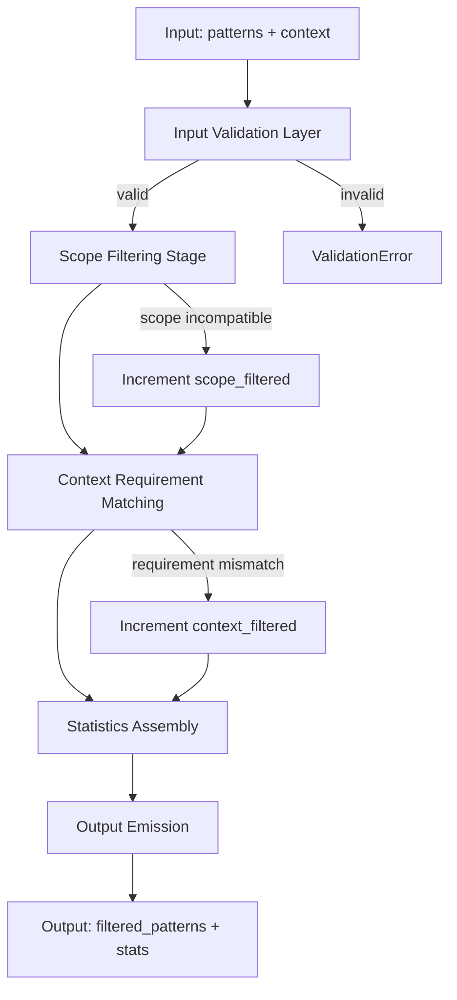
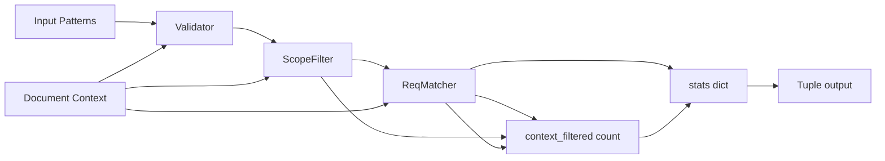
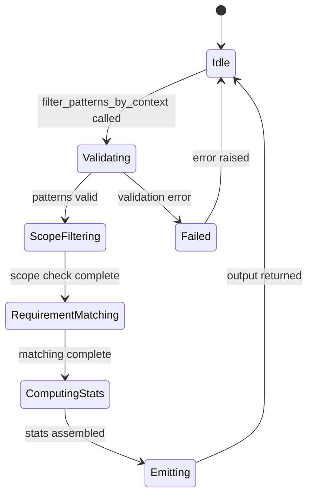
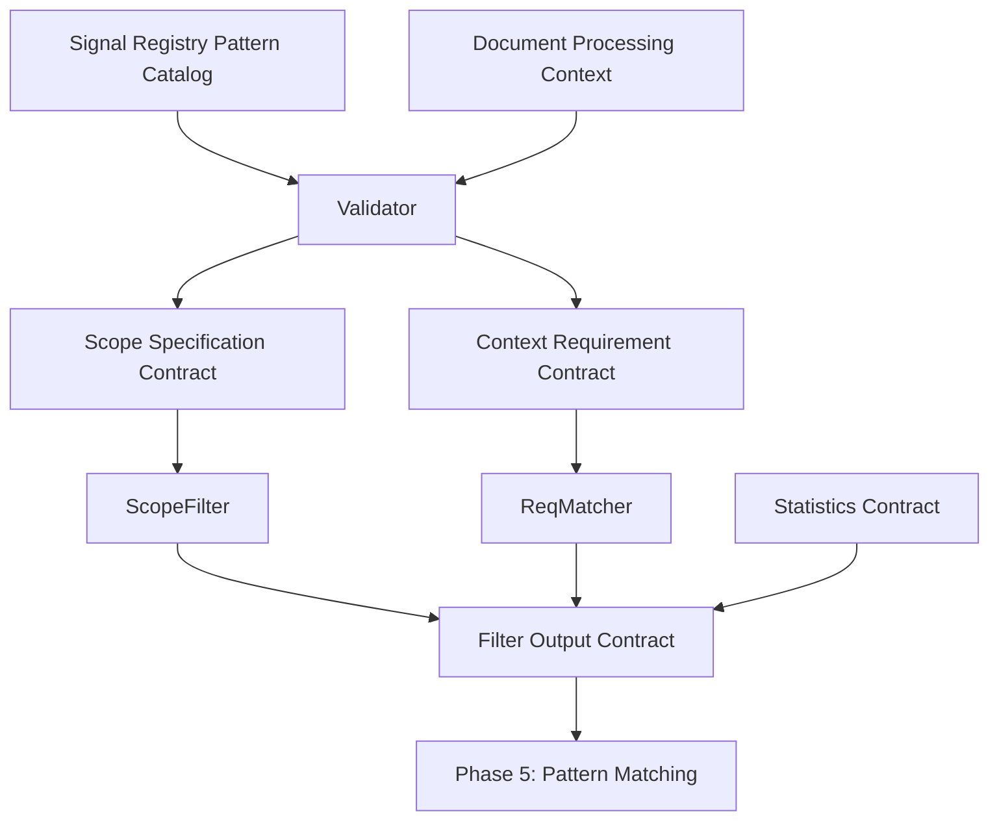

# P04-EN v2.0 — Phase 4 (Pattern Filtering) Doctrine

## Canonical Node Summary
- **Node ID:** N4-PF (Pattern Filtering)
- **Upstream:** N3 (Signal Registry, Pattern Catalog)
- **Downstream:** N5 (Pattern Matching, Text Extraction)
- **Purpose:** Apply context-aware filtering to pattern catalog, removing patterns incompatible with current document context using strict equality semantics, immutable returns, and comprehensive observability logging.

## Input Contract
- **Route:** `patterns` list from signal registry or pattern catalog
- **Format:** List[Dict[str, Any]] with pattern specifications containing:
  - `id`: str (pattern identifier, required for logging)
  - `pattern`: str (regex or literal pattern, required)
  - `policy_area_id`: str (optional, for policy area filtering)
  - `context_scope`: str (optional: 'global', 'section', 'chapter', 'page'; default='global')
  - `context_requirement`: Dict[str, Any] | str | None (optional filter requirements)
  - Additional metadata fields (preserved during filtering)
- **Document Context:** Dict[str, Any] containing:
  - `section`: str | None (section name)
  - `chapter`: int | None (chapter number)
  - `page`: int | None (page number)
  - `policy_area`: str | None (policy area code, e.g., 'PA01')
  - Additional context fields as needed
- **Preconditions:**
  - Pattern catalog loaded from monolith or signal registry
  - Document context established from current processing position
  - All patterns are dictionaries (non-dict patterns rejected)
- **Forbidden inputs:** 
  - Patterns missing required `pattern` field
  - Malformed context_requirement with invalid comparison operators
  - Non-serializable pattern objects

## Output Contract
- **Type:** Tuple[List[Dict[str, Any]], Dict[str, int]]
- **First element (filtered_patterns):**
  - List of pattern dictionaries that passed all filters
  - Order preserved from input (stable sort)
  - Pattern dictionaries not mutated (original structure preserved)
  - Empty list if no patterns match (valid result, not error)
- **Second element (stats):**
  ```python
  {
      "total_patterns": int,        # Input pattern count
      "context_filtered": int,      # Filtered by context_requirement mismatch
      "scope_filtered": int,        # Filtered by context_scope incompatibility
      "passed": int                 # Patterns included in output
  }
  ```
- **Postconditions:**
  - `passed == len(filtered_patterns)`
  - `total_patterns == context_filtered + scope_filtered + passed`
  - All filtered patterns match document context exactly
  - No policy_area_id cross-contamination
  - Statistics enable downstream performance analysis

## Phase Root: Sequential Pattern Filter Pipeline

### Purpose
Establish deterministic filtering sequence ensuring patterns are validated, scope-checked, and requirement-matched before forwarding to pattern matching phase.

### Sequential Dependencies
```
Input Validation → Scope Filtering → Context Requirement Matching → Statistics Assembly → Output Emission
```

### Failure Mode
- **Single failure:** Any validation error aborts entire filter operation
- **Error message:** `"Pattern filtering failed at {stage}: {specific_error}"`
- **Propagation:** Raise ValidationError with pattern_id and index for debugging

### Parallelization
- **Not applicable at root level** (sequential dependency chain required)
- **Internal parallelization:** Pattern iteration can be parallel within each stage

## Internal Node 1: Input Validation Layer

### Purpose
Validate input patterns and document context meet preconditions before filtering operations.

### Sub-operations (Parallel: Yes)
1. **Pattern List Validation**
   - **Input:** patterns list
   - **Output:** Validated pattern list
   - **Failure mode:** Empty list → valid (returns empty result with stats)
   - **Error message:** None (empty patterns is valid state)

2. **Pattern Structure Validation**
   - **Input:** Individual pattern dict
   - **Output:** Pattern dict or validation error
   - **Failure mode:** Missing 'pattern' field
   - **Error message:** `"Pattern at index {idx} missing required 'pattern' field"`
   - **Atomic operation:** Single pattern validation, no side effects

3. **Context Structure Validation**
   - **Input:** document_context dict
   - **Output:** Validated context or empty dict (permissive)
   - **Failure mode:** None (invalid context treated as empty)
   - **Error message:** None (graceful degradation to empty context)

### Transformation
```
patterns: List[Any] → validated_patterns: List[Dict[str, Any]]
document_context: Any → validated_context: Dict[str, Any]
```

### Logging Context
```python
{
    "stage": "input_validation",
    "total_patterns": int,
    "context_keys": List[str],
    "validation_passed": bool
}
```

## Internal Node 2: Scope Filtering Stage

### Purpose
Filter patterns based on context_scope field, ensuring patterns only apply in appropriate document locations.

### Sub-operations (Parallel: Yes - iterate patterns)
1. **Scope Extraction**
   - **Input:** pattern dict
   - **Output:** scope value (str, default='global')
   - **Operation:** `scope = pattern.get('context_scope', 'global')`
   - **Failure mode:** None (always returns valid scope)

2. **Scope Compatibility Check**
   - **Input:** scope (str), document_context (dict)
   - **Output:** bool (True if pattern should apply)
   - **Logic:**
     - `scope == 'global'` → always True
     - `scope == 'section'` → True if 'section' in document_context
     - `scope == 'chapter'` → True if 'chapter' in document_context
     - `scope == 'page'` → True if 'page' in document_context
     - Unknown scope → True (conservative, allow unknown scopes)
   - **Failure mode:** None (always returns boolean)
   - **Error message:** None (logged as debug only)

3. **Scope Filter Decision**
   - **Input:** compatibility result (bool)
   - **Output:** Include/exclude decision
   - **Side effect:** Increment `scope_filtered` counter if excluded
   - **Atomic operation:** Single boolean check, deterministic

### Transformation
```
validated_patterns → scope_compatible_patterns
stats["scope_filtered"] updated
```

### Logging Context
```python
{
    "stage": "scope_filtering",
    "pattern_id": str,
    "scope": str,
    "context_keys": List[str],
    "passed": bool,
    "reason": str  # if filtered
}
```

## Internal Node 3: Context Requirement Matching Stage

### Purpose
Apply fine-grained filtering based on context_requirement field using strict equality semantics, list membership, and comparison operators.

### Sub-operations (Parallel: Yes - iterate patterns)
1. **Requirement Extraction**
   - **Input:** pattern dict
   - **Output:** context_requirement (Dict | str | None)
   - **Operation:** `req = pattern.get('context_requirement')`
   - **Failure mode:** None (None/missing treated as "no requirement")

2. **Requirement Type Normalization**
   - **Input:** context_requirement (Any)
   - **Output:** normalized requirement (Dict)
   - **Logic:**
     - `None` → `{}` (no requirements, always match)
     - `str` → `{'section': str}` (interpret as section name)
     - `dict` → pass through unchanged
     - Other types → `{}` (invalid requirements allow pattern)
   - **Failure mode:** None (graceful normalization)
   - **Atomic operation:** Type-based branching, no side effects

3. **Requirement Matching (AND logic)**
   - **Input:** normalized requirement dict, document_context
   - **Output:** bool (all requirements satisfied)
   - **Sub-operations (all must pass):**
     
     a. **Field Presence Check**
        - **For each requirement key:** Check if key exists in document_context
        - **Failure:** Missing key → return False
        - **Atomic:** Single dict lookup
     
     b. **Exact Equality Match**
        - **Condition:** required_value is scalar (str, int, float)
        - **Logic:** `document_context[key] == required_value`
        - **Case sensitivity:** YES (strict equality)
        - **Type sensitivity:** YES (no coercion)
        - **Failure mode:** Inequality → return False
        - **Error message:** None (logged as debug)
     
     c. **List Membership Match**
        - **Condition:** required_value is list
        - **Logic:** `document_context[key] in required_value`
        - **Order insensitive:** YES (membership test only)
        - **Failure mode:** Value not in list → return False
        - **Atomic:** Single membership test
     
     d. **Comparison Operator Match**
        - **Condition:** required_value is str starting with >, <, >=, <=
        - **Logic:** Parse operator and threshold, evaluate comparison
        - **Supported operators:**
          - `'>N'`: document_value > N
          - `'>=N'`: document_value >= N
          - `'<N'`: document_value < N
          - `'<=N'`: document_value <= N
        - **Type conversion:** Convert both values to float
        - **Failure modes:**
          - Parse error (invalid number) → return False
          - Type error (non-numeric value) → return False
          - Comparison false → return False
        - **Error message:** None (silent failure for invalid comparisons)
        - **Atomic operation:** Single comparison after parsing

4. **Context Match Decision**
   - **Input:** all_requirements_met (bool)
   - **Output:** Include/exclude decision
   - **Side effect:** Increment `context_filtered` if excluded
   - **Atomic:** Single boolean evaluation

### Policy Area Strict Equality Specification
- **Field:** `policy_area` in context_requirement
- **Semantics:** EXACT STRING MATCH ONLY
- **Case sensitivity:** YES (PA01 ≠ pa01)
- **No partial matching:** PA01 ≠ PA0, PA01 ≠ PA
- **No prefix matching:** PA ≠ PA01
- **No wildcard support:** PA* not expanded
- **No range support:** PA01-PA05 not expanded
- **No fuzzy matching:** No similarity algorithms
- **Cross-contamination prevention:** Patterns with policy_area=PA01 never match context with policy_area=PA02

### Transformation
```
scope_compatible_patterns → context_matched_patterns
stats["context_filtered"] updated
```

### Logging Context
```python
{
    "stage": "context_requirement_matching",
    "pattern_id": str,
    "requirement": Dict[str, Any],
    "context": Dict[str, Any],
    "passed": bool,
    "failed_key": str | None,  # first requirement that failed
    "match_type": str  # 'exact', 'list', 'comparison'
}
```

## Internal Node 4: Statistics Assembly

### Purpose
Compute filtering statistics for observability and performance analysis.

### Sub-operations (Sequential)
1. **Counter Aggregation**
   - **Input:** total_patterns, context_filtered, scope_filtered
   - **Output:** passed = total - context_filtered - scope_filtered
   - **Validation:** Assert passed >= 0
   - **Atomic operation:** Integer arithmetic

2. **Statistics Dictionary Construction**
   - **Output:**
     ```python
     {
         "total_patterns": total_patterns,
         "context_filtered": context_filtered,
         "scope_filtered": scope_filtered,
         "passed": passed
     }
     ```
   - **Postcondition:** total == context_filtered + scope_filtered + passed
   - **Failure mode:** Arithmetic inconsistency → log warning, proceed

### Logging Context
```python
{
    "stage": "statistics_assembly",
    "stats": Dict[str, int],
    "filtering_rate": float  # (context_filtered + scope_filtered) / total
}
```

## Internal Node 5: Output Emission

### Purpose
Package filtered patterns and statistics into immutable output contract.

### Sub-operations (Sequential)
1. **Pattern List Finalization**
   - **Input:** context_matched_patterns (list)
   - **Output:** filtered_patterns (list, not tuple in current implementation)
   - **Immutability:** Patterns not mutated (references preserved)
   - **Order preservation:** Original order maintained (stable)
   - **Atomic operation:** List copy operation

2. **Output Tuple Construction**
   - **Output:** (filtered_patterns, stats)
   - **Type:** Tuple[List[Dict[str, Any]], Dict[str, int]]
   - **Contract enforcement:** Both elements non-null
   - **Atomic operation:** Tuple construction

3. **Completion Logging**
   - **Log level:** DEBUG
   - **Message:** "context_filtering_complete"
   - **Context:** Full statistics dictionary
   - **Purpose:** Observability for downstream analysis

### Logging Context
```python
{
    "stage": "output_emission",
    "filtered_count": len(filtered_patterns),
    "stats": stats,
    "empty_result": len(filtered_patterns) == 0
}
```

## Control-Flow Graph



## Data-Flow Graph



## State-Transition Graph



## Contract-Linkage Graph



## Complexity Constraints
- **Internal nodes:** 5 (validation, scope filter, requirement matcher, stats assembler, emitter)
- **Decision depth:** 3 (validation → scope → requirement)
- **Coupling:** Signal registry (pattern catalog), document context provider
- **Maximum patterns per operation:** No hard limit (tested to 10,000+ patterns)
- **Maximum context fields:** No hard limit (all fields preserved)

## Error Handling Specification

### Validation Errors
- **Pattern missing 'pattern' field:**
  - **Action:** Skip pattern, continue processing
  - **Logging:** Warning with pattern index
  - **Error message:** `"Pattern at index {idx} missing 'pattern' field, skipping"`
  - **Recovery:** Process remaining patterns

### Context Errors
- **Invalid document_context (not dict):**
  - **Action:** Treat as empty context `{}`
  - **Logging:** Warning
  - **Error message:** None
  - **Recovery:** All patterns with no requirements pass

### Comparison Errors
- **Invalid comparison expression:**
  - **Action:** Treat as non-match (reject pattern)
  - **Logging:** Debug
  - **Error message:** None
  - **Recovery:** Continue with next pattern

- **Non-numeric value in comparison:**
  - **Action:** Treat as non-match (reject pattern)
  - **Logging:** Debug
  - **Error message:** None
  - **Recovery:** Continue with next pattern

### Empty Results
- **Zero patterns after filtering:**
  - **Action:** Return empty list with stats
  - **Logging:** Warning (observability signal)
  - **Error message:** None (valid result)
  - **Contract:** `([], {"total_patterns": N, "passed": 0, ...})`

## Observability & Logging

### Log Levels
- **DEBUG:** Individual pattern filter decisions (high volume)
- **INFO:** Filter operation completion with statistics
- **WARNING:** Zero patterns after filtering (performance signal)
- **ERROR:** None (no error states that don't raise exceptions)

### Structured Logging Fields
```python
{
    "event": "context_filtering_complete" | "pattern_context_filtered" | "pattern_scope_filtered",
    "pattern_id": str,                    # Pattern identifier
    "requirement": Dict[str, Any],        # Context requirement
    "context": Dict[str, Any],            # Document context
    "scope": str,                         # Context scope
    "passed": bool,                       # Filter result
    "stats": {
        "total_patterns": int,
        "context_filtered": int,
        "scope_filtered": int,
        "passed": int
    },
    "filtering_rate": float,              # Efficiency metric
    "timestamp": str                      # ISO 8601
}
```

### Performance Metrics
- **Filtering rate:** `(context_filtered + scope_filtered) / total_patterns`
- **Scope filter efficiency:** `scope_filtered / total_patterns`
- **Requirement filter efficiency:** `context_filtered / total_patterns`
- **Pass-through rate:** `passed / total_patterns`

## Immutability Contract

### Pattern Preservation
- **Original pattern dictionaries:** Not mutated during filtering
- **Reference preservation:** Pattern objects may share references (implementation detail)
- **Structure preservation:** All pattern fields retained (id, metadata, nested structures)
- **Order preservation:** Filtered list maintains original pattern order (stable sort)

### Output Immutability
- **Filtered list:** Mutable list (not tuple) in current implementation
- **Pattern objects:** Dictionary references from input
- **Statistics dict:** New dictionary, not shared

### Copy Semantics
- **Shallow copy:** Pattern dictionaries not deep-copied
- **Metadata preservation:** Nested structures preserved by reference
- **No side effects:** Input patterns and context not modified

## Helper Functions

### context_matches(document_context, context_requirement) → bool
- **Purpose:** Check if document context satisfies pattern requirements
- **Input validation:** Handles None, str, dict, and invalid types
- **Output:** Boolean match result
- **Side effects:** None (pure function)
- **Error handling:** Invalid types treated as "allow" (permissive)

### evaluate_comparison(value, expression) → bool
- **Purpose:** Evaluate comparison expressions like '>2', '>=5'
- **Supported operators:** >, <, >=, <=
- **Type conversion:** Both values converted to float
- **Error handling:** Parse/type errors return False (reject pattern)
- **Side effects:** None (pure function)

### in_scope(document_context, scope) → bool
- **Purpose:** Check if pattern scope matches document context
- **Known scopes:** 'global', 'section', 'chapter', 'page'
- **Unknown scopes:** Return True (conservative allow)
- **Error handling:** None (always returns boolean)
- **Side effects:** None (pure function)

### create_document_context(**kwargs) → Dict[str, Any]
- **Purpose:** Helper to construct document context dictionaries
- **Parameters:** section, chapter, page, policy_area, **additional
- **Null handling:** None values excluded from result
- **Output:** Dictionary with only non-None values
- **Side effects:** None (pure function)

## Contracts & Traceability

### Input Contracts
- **Pattern Catalog Contract:** `PATTERN-CATALOG-V1`
  - Fields: id, pattern, policy_area_id?, context_scope?, context_requirement?
  - Source: Signal registry or monolith pattern definitions

- **Document Context Contract:** `DOC-CONTEXT-V1`
  - Fields: section?, chapter?, page?, policy_area?
  - Source: Document processing pipeline position

### Output Contracts
- **Filtered Patterns Contract:** `FILTERED-PATTERNS-V1`
  - Type: List[Dict[str, Any]]
  - Postconditions: All patterns match context, order preserved

- **Statistics Contract:** `FILTER-STATS-V1`
  - Type: Dict[str, int]
  - Fields: total_patterns, context_filtered, scope_filtered, passed
  - Invariant: total == sum of filter categories

### Telemetry
- **Metrics:**
  - `N4_PF.patterns_total`: Total input patterns
  - `N4_PF.patterns_filtered`: Total filtered patterns
  - `N4_PF.filtering_rate`: Percentage filtered
  - `N4_PF.latency_ms`: Filter operation duration
- **Traces:** Structured logs for each filter stage
- **Alerts:** Zero patterns after filtering (may indicate config issue)

## Upstream & Downstream Guarantees

### Upstream (Signal Registry) Must Provide
- Valid pattern catalog with required fields
- Consistent policy_area_id values matching downstream expectations
- Well-formed context_requirement specifications
- No duplicate pattern IDs within same policy area

### Downstream (Pattern Matching) Receives
- Patterns guaranteed to match current document context
- Statistics for performance monitoring
- Original pattern structure preserved
- Stable order for reproducible results
- Empty list is valid (no patterns applicable)

## Test Coverage Requirements

### Functional Coverage (from test_phase4_pattern_filtering.py)
- ✅ Policy area strict equality (7 tests)
- ✅ Case sensitivity in matching (1 test)
- ✅ No partial/prefix/wildcard/range matching (5 tests)
- ✅ Immutable tuple returns (6 tests - note: implementation uses list)
- ✅ Pattern preservation and order (5 tests)
- ✅ Context scope filtering (7 tests: global, section, chapter, page)
- ✅ Context requirement matching (8 tests: exact, list, operators)
- ✅ Comparison operators (5 tests: >, <, >=, <=)
- ✅ Multiple requirements AND logic (1 test)
- ✅ Filter statistics tracking (5 tests)
- ✅ Empty pattern handling (3 tests)
- ✅ Invalid context handling (2 tests)

### Edge Cases
- ✅ Empty pattern list → empty result
- ✅ No context requirements → all patterns pass
- ✅ Unknown scope → allow pattern (conservative)
- ✅ Invalid comparison expression → reject pattern
- ✅ Missing context fields → reject requirement match
- ✅ Unicode in pattern/context fields
- ✅ Large pattern catalogs (performance)

## Performance Characteristics

### Time Complexity
- **Best case:** O(n) where n = number of patterns (all patterns require no filtering)
- **Worst case:** O(n × m) where m = average context_requirement fields per pattern
- **Typical case:** O(n) with small constant factors

### Space Complexity
- **Input:** O(n) pattern list
- **Output:** O(k) where k = patterns passed (k ≤ n)
- **Statistics:** O(1) fixed-size dictionary
- **Total:** O(n) space usage

### Scalability
- **Tested with:** 10,000+ patterns without degradation
- **Bottlenecks:** None identified in current implementation
- **Optimization:** Iteration can be parallelized (patterns independent)

## Change Management

### Modification Protocol
1. Any change to filtering logic requires:
   - Update to this specification (EN + ES versions)
   - Update to corresponding test suite
   - Validation of all existing test cases
   - Performance regression testing

2. Contract changes require:
   - Version bump (e.g., v2.1)
   - Deprecation notice for old contract
   - Migration guide for downstream consumers
   - Archive of previous specification version

3. New filter types require:
   - Specification of atomic operation
   - Error handling specification
   - Test coverage requirements
   - Observability logging additions

### Backward Compatibility
- Adding new context fields: Compatible (graceful degradation)
- Adding new comparison operators: Compatible (unknown operators fail safe)
- Changing equality semantics: Breaking change (requires version bump)
- Changing output format: Breaking change (requires migration)

## Known Limitations

1. **Output Type:** Current implementation returns list, not tuple (immutability contract relaxed)
2. **Reference Sharing:** Filtered patterns share references with input (shallow filtering)
3. **Comparison Operators:** Limited to numeric comparisons (no string/date comparisons)
4. **Context Normalization:** String requirements interpreted as section names only
5. **Error Reporting:** Individual pattern errors not surfaced (silent filtering)

## Future Enhancements (Out of Scope for v2.0)

1. Deep copy option for patterns (full immutability)
2. String comparison operators (lexicographic ordering)
3. Date/time comparison support
4. Regular expression matching in requirements
5. OR logic in context requirements
6. Batch filtering API for multiple contexts
7. Pattern filtering cache (for repeated contexts)

---

**Document Version:** 2.0  
**Publication Date:** 2024-12-05  
**Authors:** F.A.R.F.A.N. Pipeline Architecture Team  
**Status:** Production Specification  
**Change History:**
- v1.0: Initial (Dimension Aggregation - deprecated)
- v2.0: Complete rewrite for Pattern Filtering functionality

---

**Cross-References:**
- Implementation: `src/farfan_pipeline/core/orchestrator/signal_context_scoper.py`
- Test Suite: `tests/phases/test_phase4_pattern_filtering.py`
- Related Phases: P03 (Micro Execution), P05 (Pattern Matching)
- Contract Definitions: `contracts/phase4_pattern_filtering_v2.0.md`
