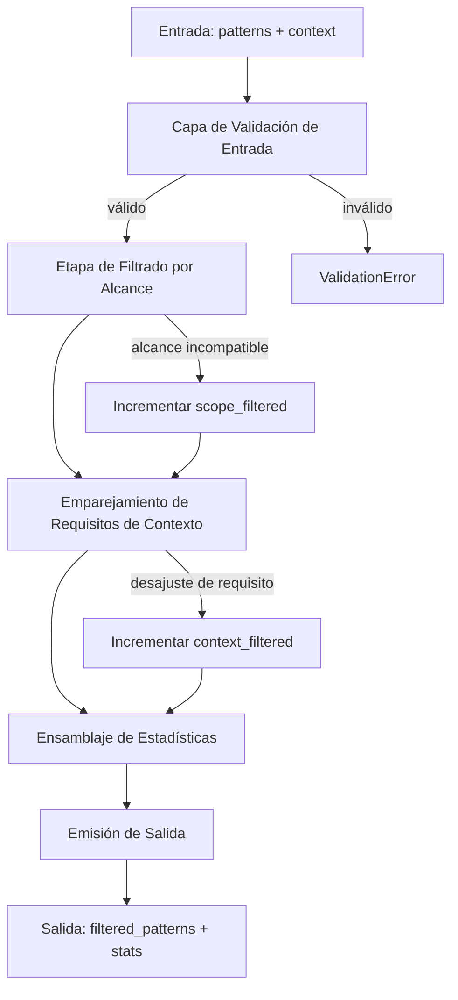
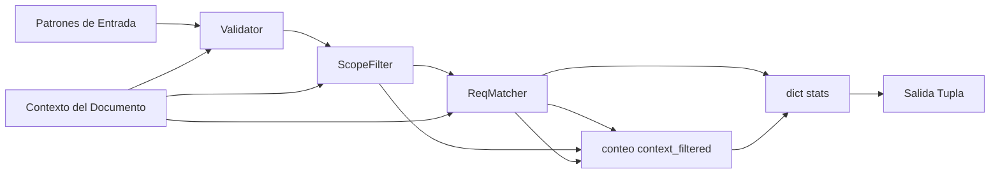
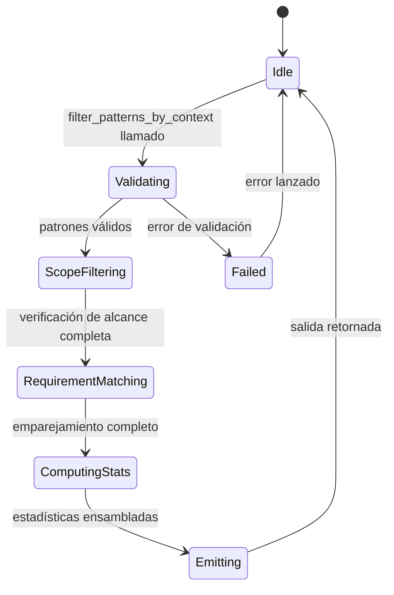
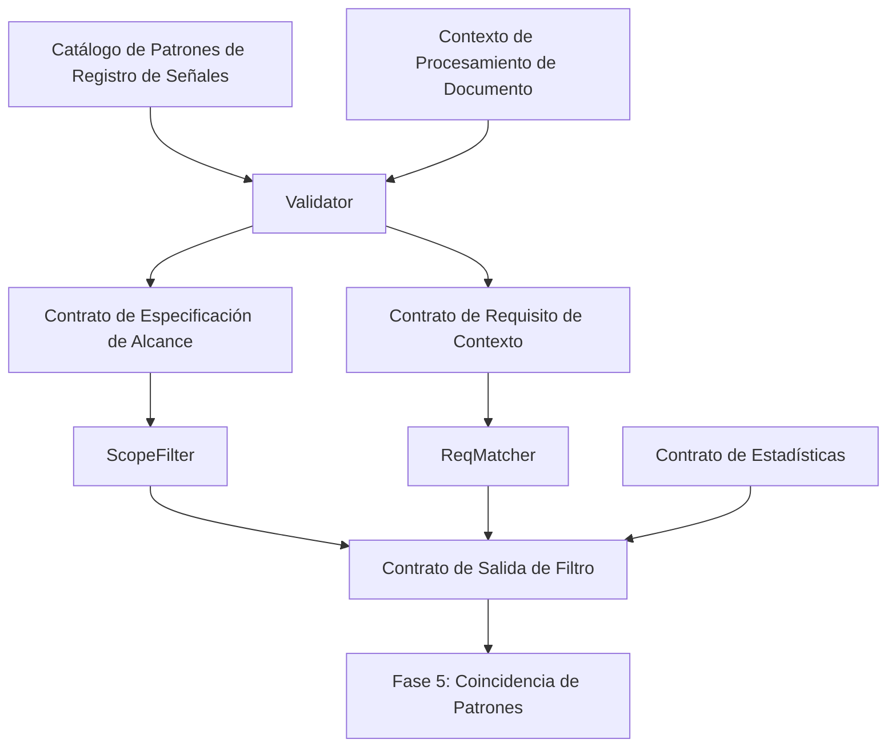

# P04-ES v2.0 — Fase 4 (Filtrado de Patrones) Doctrina

## Resumen Canónico del Nodo
- **ID del Nodo:** N4-PF (Filtrado de Patrones)
- **Aguas arriba:** N3 (Registro de Señales, Catálogo de Patrones)
- **Aguas abajo:** N5 (Coincidencia de Patrones, Extracción de Texto)
- **Propósito:** Aplicar filtrado consciente del contexto al catálogo de patrones, eliminando patrones incompatibles con el contexto actual del documento usando semántica de igualdad estricta, retornos inmutables y registro de observabilidad integral.

## Contrato de Entrada
- **Ruta:** lista de `patterns` desde registro de señales o catálogo de patrones
- **Formato:** List[Dict[str, Any]] con especificaciones de patrones conteniendo:
  - `id`: str (identificador de patrón, requerido para logging)
  - `pattern`: str (patrón regex o literal, requerido)
  - `policy_area_id`: str (opcional, para filtrado por área de política)
  - `context_scope`: str (opcional: 'global', 'section', 'chapter', 'page'; predeterminado='global')
  - `context_requirement`: Dict[str, Any] | str | None (requisitos de filtro opcionales)
  - Campos de metadatos adicionales (preservados durante el filtrado)
- **Contexto del Documento:** Dict[str, Any] conteniendo:
  - `section`: str | None (nombre de sección)
  - `chapter`: int | None (número de capítulo)
  - `page`: int | None (número de página)
  - `policy_area`: str | None (código de área de política, ej., 'PA01')
  - Campos de contexto adicionales según necesidad
- **Precondiciones:**
  - Catálogo de patrones cargado desde monolito o registro de señales
  - Contexto del documento establecido desde posición de procesamiento actual
  - Todos los patrones son diccionarios (patrones no-dict rechazados)
- **Entradas prohibidas:** 
  - Patrones sin campo `pattern` requerido
  - context_requirement malformado con operadores de comparación inválidos
  - Objetos de patrón no serializables

## Contrato de Salida
- **Tipo:** Tuple[List[Dict[str, Any]], Dict[str, int]]
- **Primer elemento (filtered_patterns):**
  - Lista de diccionarios de patrones que pasaron todos los filtros
  - Orden preservado de la entrada (ordenamiento estable)
  - Diccionarios de patrones no mutados (estructura original preservada)
  - Lista vacía si ningún patrón coincide (resultado válido, no error)
- **Segundo elemento (stats):**
  ```python
  {
      "total_patterns": int,        # Conteo de patrones de entrada
      "context_filtered": int,      # Filtrados por desajuste de context_requirement
      "scope_filtered": int,        # Filtrados por incompatibilidad de context_scope
      "passed": int                 # Patrones incluidos en salida
  }
  ```
- **Postcondiciones:**
  - `passed == len(filtered_patterns)`
  - `total_patterns == context_filtered + scope_filtered + passed`
  - Todos los patrones filtrados coinciden exactamente con el contexto del documento
  - Sin contaminación cruzada de policy_area_id
  - Estadísticas permiten análisis de rendimiento aguas abajo

## Raíz de Fase: Pipeline Secuencial de Filtro de Patrones

### Propósito
Establecer secuencia de filtrado determinística asegurando que los patrones sean validados, verificados por alcance y emparejados por requisitos antes de reenviar a la fase de coincidencia de patrones.

### Dependencias Secuenciales
```
Validación de Entrada → Filtrado por Alcance → Emparejamiento de Requisitos de Contexto → Ensamblaje de Estadísticas → Emisión de Salida
```

### Modo de Falla
- **Falla única:** Cualquier error de validación aborta toda la operación de filtro
- **Mensaje de error:** `"Pattern filtering failed at {stage}: {specific_error}"`
- **Propagación:** Lanzar ValidationError con pattern_id e índice para depuración

### Paralelización
- **No aplicable a nivel raíz** (cadena de dependencia secuencial requerida)
- **Paralelización interna:** La iteración de patrones puede ser paralela dentro de cada etapa

## Nodo Interno 1: Capa de Validación de Entrada

### Propósito
Validar que los patrones de entrada y el contexto del documento cumplan las precondiciones antes de las operaciones de filtrado.

### Sub-operaciones (Paralelo: Sí)
1. **Validación de Lista de Patrones**
   - **Entrada:** lista de patterns
   - **Salida:** Lista de patrones validada
   - **Modo de falla:** Lista vacía → válido (retorna resultado vacío con estadísticas)
   - **Mensaje de error:** Ninguno (patrones vacíos es estado válido)

2. **Validación de Estructura de Patrón**
   - **Entrada:** Diccionario de patrón individual
   - **Salida:** Diccionario de patrón o error de validación
   - **Modo de falla:** Campo 'pattern' faltante
   - **Mensaje de error:** `"Pattern at index {idx} missing required 'pattern' field"`
   - **Operación atómica:** Validación de patrón único, sin efectos secundarios

3. **Validación de Estructura de Contexto**
   - **Entrada:** diccionario document_context
   - **Salida:** Contexto validado o dict vacío (permisivo)
   - **Modo de falla:** Ninguno (contexto inválido tratado como vacío)
   - **Mensaje de error:** Ninguno (degradación graciosa a contexto vacío)

### Transformación
```
patterns: List[Any] → validated_patterns: List[Dict[str, Any]]
document_context: Any → validated_context: Dict[str, Any]
```

### Contexto de Logging
```python
{
    "stage": "input_validation",
    "total_patterns": int,
    "context_keys": List[str],
    "validation_passed": bool
}
```

## Nodo Interno 2: Etapa de Filtrado por Alcance

### Propósito
Filtrar patrones basados en el campo context_scope, asegurando que los patrones solo se apliquen en ubicaciones apropiadas del documento.

### Sub-operaciones (Paralelo: Sí - iterar patrones)
1. **Extracción de Alcance**
   - **Entrada:** diccionario de patrón
   - **Salida:** valor de scope (str, predeterminado='global')
   - **Operación:** `scope = pattern.get('context_scope', 'global')`
   - **Modo de falla:** Ninguno (siempre retorna scope válido)

2. **Verificación de Compatibilidad de Alcance**
   - **Entrada:** scope (str), document_context (dict)
   - **Salida:** bool (True si el patrón debe aplicarse)
   - **Lógica:**
     - `scope == 'global'` → siempre True
     - `scope == 'section'` → True si 'section' en document_context
     - `scope == 'chapter'` → True si 'chapter' en document_context
     - `scope == 'page'` → True si 'page' en document_context
     - Alcance desconocido → True (conservador, permitir alcances desconocidos)
   - **Modo de falla:** Ninguno (siempre retorna booleano)
   - **Mensaje de error:** Ninguno (registrado como debug solamente)

3. **Decisión de Filtro de Alcance**
   - **Entrada:** resultado de compatibilidad (bool)
   - **Salida:** Decisión de incluir/excluir
   - **Efecto secundario:** Incrementar contador `scope_filtered` si excluido
   - **Operación atómica:** Verificación booleana única, determinística

### Transformación
```
validated_patterns → scope_compatible_patterns
stats["scope_filtered"] actualizado
```

### Contexto de Logging
```python
{
    "stage": "scope_filtering",
    "pattern_id": str,
    "scope": str,
    "context_keys": List[str],
    "passed": bool,
    "reason": str  # si filtrado
}
```

## Nodo Interno 3: Etapa de Emparejamiento de Requisitos de Contexto

### Propósito
Aplicar filtrado fino basado en el campo context_requirement usando semántica de igualdad estricta, membresía de lista y operadores de comparación.

### Sub-operaciones (Paralelo: Sí - iterar patrones)
1. **Extracción de Requisitos**
   - **Entrada:** diccionario de patrón
   - **Salida:** context_requirement (Dict | str | None)
   - **Operación:** `req = pattern.get('context_requirement')`
   - **Modo de falla:** Ninguno (None/faltante tratado como "sin requisito")

2. **Normalización de Tipo de Requisito**
   - **Entrada:** context_requirement (Any)
   - **Salida:** requisito normalizado (Dict)
   - **Lógica:**
     - `None` → `{}` (sin requisitos, siempre coincide)
     - `str` → `{'section': str}` (interpretar como nombre de sección)
     - `dict` → pasar sin cambios
     - Otros tipos → `{}` (requisitos inválidos permiten patrón)
   - **Modo de falla:** Ninguno (normalización graciosa)
   - **Operación atómica:** Ramificación basada en tipo, sin efectos secundarios

3. **Emparejamiento de Requisitos (lógica AND)**
   - **Entrada:** diccionario de requisito normalizado, document_context
   - **Salida:** bool (todos los requisitos satisfechos)
   - **Sub-operaciones (todas deben pasar):**
     
     a. **Verificación de Presencia de Campo**
        - **Para cada clave de requisito:** Verificar si la clave existe en document_context
        - **Falla:** Clave faltante → retornar False
        - **Atómico:** Búsqueda única en diccionario
     
     b. **Emparejamiento de Igualdad Exacta**
        - **Condición:** required_value es escalar (str, int, float)
        - **Lógica:** `document_context[key] == required_value`
        - **Sensibilidad a mayúsculas:** SÍ (igualdad estricta)
        - **Sensibilidad a tipo:** SÍ (sin coerción)
        - **Modo de falla:** Desigualdad → retornar False
        - **Mensaje de error:** Ninguno (registrado como debug)
     
     c. **Emparejamiento de Membresía de Lista**
        - **Condición:** required_value es lista
        - **Lógica:** `document_context[key] in required_value`
        - **Insensible al orden:** SÍ (solo prueba de membresía)
        - **Modo de falla:** Valor no en lista → retornar False
        - **Atómico:** Prueba única de membresía
     
     d. **Emparejamiento de Operador de Comparación**
        - **Condición:** required_value es str comenzando con >, <, >=, <=
        - **Lógica:** Analizar operador y umbral, evaluar comparación
        - **Operadores soportados:**
          - `'>N'`: document_value > N
          - `'>=N'`: document_value >= N
          - `'<N'`: document_value < N
          - `'<=N'`: document_value <= N
        - **Conversión de tipo:** Convertir ambos valores a float
        - **Modos de falla:**
          - Error de análisis (número inválido) → retornar False
          - Error de tipo (valor no numérico) → retornar False
          - Comparación falsa → retornar False
        - **Mensaje de error:** Ninguno (falla silenciosa para comparaciones inválidas)
        - **Operación atómica:** Comparación única después del análisis

4. **Decisión de Emparejamiento de Contexto**
   - **Entrada:** all_requirements_met (bool)
   - **Salida:** Decisión de incluir/excluir
   - **Efecto secundario:** Incrementar `context_filtered` si excluido
   - **Atómico:** Evaluación booleana única

### Especificación de Igualdad Estricta de Área de Política
- **Campo:** `policy_area` en context_requirement
- **Semántica:** SOLO COINCIDENCIA EXACTA DE CADENA
- **Sensibilidad a mayúsculas:** SÍ (PA01 ≠ pa01)
- **Sin coincidencia parcial:** PA01 ≠ PA0, PA01 ≠ PA
- **Sin coincidencia de prefijo:** PA ≠ PA01
- **Sin soporte de comodines:** PA* no expandido
- **Sin soporte de rangos:** PA01-PA05 no expandido
- **Sin coincidencia difusa:** Sin algoritmos de similitud
- **Prevención de contaminación cruzada:** Patrones con policy_area=PA01 nunca coinciden con contexto con policy_area=PA02

### Transformación
```
scope_compatible_patterns → context_matched_patterns
stats["context_filtered"] actualizado
```

### Contexto de Logging
```python
{
    "stage": "context_requirement_matching",
    "pattern_id": str,
    "requirement": Dict[str, Any],
    "context": Dict[str, Any],
    "passed": bool,
    "failed_key": str | None,  # primer requisito que falló
    "match_type": str  # 'exact', 'list', 'comparison'
}
```

## Nodo Interno 4: Ensamblaje de Estadísticas

### Propósito
Computar estadísticas de filtrado para observabilidad y análisis de rendimiento.

### Sub-operaciones (Secuencial)
1. **Agregación de Contadores**
   - **Entrada:** total_patterns, context_filtered, scope_filtered
   - **Salida:** passed = total - context_filtered - scope_filtered
   - **Validación:** Afirmar passed >= 0
   - **Operación atómica:** Aritmética de enteros

2. **Construcción de Diccionario de Estadísticas**
   - **Salida:**
     ```python
     {
         "total_patterns": total_patterns,
         "context_filtered": context_filtered,
         "scope_filtered": scope_filtered,
         "passed": passed
     }
     ```
   - **Postcondición:** total == context_filtered + scope_filtered + passed
   - **Modo de falla:** Inconsistencia aritmética → registrar advertencia, continuar

### Contexto de Logging
```python
{
    "stage": "statistics_assembly",
    "stats": Dict[str, int],
    "filtering_rate": float  # (context_filtered + scope_filtered) / total
}
```

## Nodo Interno 5: Emisión de Salida

### Propósito
Empaquetar patrones filtrados y estadísticas en contrato de salida inmutable.

### Sub-operaciones (Secuencial)
1. **Finalización de Lista de Patrones**
   - **Entrada:** context_matched_patterns (list)
   - **Salida:** filtered_patterns (list, no tuple en implementación actual)
   - **Inmutabilidad:** Patrones no mutados (referencias preservadas)
   - **Preservación de orden:** Orden original mantenido (estable)
   - **Operación atómica:** Operación de copia de lista

2. **Construcción de Tupla de Salida**
   - **Salida:** (filtered_patterns, stats)
   - **Tipo:** Tuple[List[Dict[str, Any]], Dict[str, int]]
   - **Cumplimiento de contrato:** Ambos elementos no nulos
   - **Operación atómica:** Construcción de tupla

3. **Logging de Finalización**
   - **Nivel de log:** DEBUG
   - **Mensaje:** "context_filtering_complete"
   - **Contexto:** Diccionario completo de estadísticas
   - **Propósito:** Observabilidad para análisis aguas abajo

### Contexto de Logging
```python
{
    "stage": "output_emission",
    "filtered_count": len(filtered_patterns),
    "stats": stats,
    "empty_result": len(filtered_patterns) == 0
}
```

## Gráfico de Flujo de Control



## Gráfico de Flujo de Datos



## Gráfico de Transición de Estados



## Gráfico de Enlace de Contratos



## Restricciones de Complejidad
- **Nodos internos:** 5 (validación, filtro de alcance, emparejador de requisitos, ensamblador de estadísticas, emisor)
- **Profundidad de decisión:** 3 (validación → alcance → requisito)
- **Acoplamiento:** Registro de señales (catálogo de patrones), proveedor de contexto de documento
- **Máximo de patrones por operación:** Sin límite duro (probado hasta 10,000+ patrones)
- **Máximo de campos de contexto:** Sin límite duro (todos los campos preservados)

## Especificación de Manejo de Errores

### Errores de Validación
- **Patrón sin campo 'pattern':**
  - **Acción:** Saltar patrón, continuar procesamiento
  - **Logging:** Advertencia con índice de patrón
  - **Mensaje de error:** `"Pattern at index {idx} missing 'pattern' field, skipping"`
  - **Recuperación:** Procesar patrones restantes

### Errores de Contexto
- **document_context inválido (no dict):**
  - **Acción:** Tratar como contexto vacío `{}`
  - **Logging:** Advertencia
  - **Mensaje de error:** Ninguno
  - **Recuperación:** Todos los patrones sin requisitos pasan

### Errores de Comparación
- **Expresión de comparación inválida:**
  - **Acción:** Tratar como no coincidencia (rechazar patrón)
  - **Logging:** Debug
  - **Mensaje de error:** Ninguno
  - **Recuperación:** Continuar con siguiente patrón

- **Valor no numérico en comparación:**
  - **Acción:** Tratar como no coincidencia (rechazar patrón)
  - **Logging:** Debug
  - **Mensaje de error:** Ninguno
  - **Recuperación:** Continuar con siguiente patrón

### Resultados Vacíos
- **Cero patrones después de filtrado:**
  - **Acción:** Retornar lista vacía con estadísticas
  - **Logging:** Advertencia (señal de observabilidad)
  - **Mensaje de error:** Ninguno (resultado válido)
  - **Contrato:** `([], {"total_patterns": N, "passed": 0, ...})`

## Observabilidad y Logging

### Niveles de Log
- **DEBUG:** Decisiones individuales de filtro de patrón (alto volumen)
- **INFO:** Finalización de operación de filtro con estadísticas
- **WARNING:** Cero patrones después de filtrado (señal de rendimiento)
- **ERROR:** Ninguno (sin estados de error que no lancen excepciones)

### Campos de Logging Estructurado
```python
{
    "event": "context_filtering_complete" | "pattern_context_filtered" | "pattern_scope_filtered",
    "pattern_id": str,                    # Identificador de patrón
    "requirement": Dict[str, Any],        # Requisito de contexto
    "context": Dict[str, Any],            # Contexto del documento
    "scope": str,                         # Alcance de contexto
    "passed": bool,                       # Resultado del filtro
    "stats": {
        "total_patterns": int,
        "context_filtered": int,
        "scope_filtered": int,
        "passed": int
    },
    "filtering_rate": float,              # Métrica de eficiencia
    "timestamp": str                      # ISO 8601
}
```

### Métricas de Rendimiento
- **Tasa de filtrado:** `(context_filtered + scope_filtered) / total_patterns`
- **Eficiencia de filtro de alcance:** `scope_filtered / total_patterns`
- **Eficiencia de filtro de requisitos:** `context_filtered / total_patterns`
- **Tasa de paso:** `passed / total_patterns`

## Contrato de Inmutabilidad

### Preservación de Patrones
- **Diccionarios de patrones originales:** No mutados durante el filtrado
- **Preservación de referencia:** Objetos de patrón pueden compartir referencias (detalle de implementación)
- **Preservación de estructura:** Todos los campos de patrón retenidos (id, metadata, estructuras anidadas)
- **Preservación de orden:** Lista filtrada mantiene orden de patrón original (ordenamiento estable)

### Inmutabilidad de Salida
- **Lista filtrada:** Lista mutable (no tuple) en implementación actual
- **Objetos de patrón:** Referencias de diccionario de entrada
- **Dict de estadísticas:** Nuevo diccionario, no compartido

### Semántica de Copia
- **Copia superficial:** Diccionarios de patrones no copiados profundamente
- **Preservación de metadata:** Estructuras anidadas preservadas por referencia
- **Sin efectos secundarios:** Patrones de entrada y contexto no modificados

## Funciones Auxiliares

### context_matches(document_context, context_requirement) → bool
- **Propósito:** Verificar si el contexto del documento satisface requisitos de patrón
- **Validación de entrada:** Maneja None, str, dict y tipos inválidos
- **Salida:** Resultado de coincidencia booleano
- **Efectos secundarios:** Ninguno (función pura)
- **Manejo de errores:** Tipos inválidos tratados como "permitir" (permisivo)

### evaluate_comparison(value, expression) → bool
- **Propósito:** Evaluar expresiones de comparación como '>2', '>=5'
- **Operadores soportados:** >, <, >=, <=
- **Conversión de tipo:** Ambos valores convertidos a float
- **Manejo de errores:** Errores de análisis/tipo retornan False (rechazar patrón)
- **Efectos secundarios:** Ninguno (función pura)

### in_scope(document_context, scope) → bool
- **Propósito:** Verificar si el alcance del patrón coincide con el contexto del documento
- **Alcances conocidos:** 'global', 'section', 'chapter', 'page'
- **Alcances desconocidos:** Retornar True (permitir conservador)
- **Manejo de errores:** Ninguno (siempre retorna booleano)
- **Efectos secundarios:** Ninguno (función pura)

### create_document_context(**kwargs) → Dict[str, Any]
- **Propósito:** Auxiliar para construir diccionarios de contexto de documento
- **Parámetros:** section, chapter, page, policy_area, **additional
- **Manejo de nulos:** Valores None excluidos del resultado
- **Salida:** Diccionario con solo valores no-None
- **Efectos secundarios:** Ninguno (función pura)

## Contratos y Trazabilidad

### Contratos de Entrada
- **Contrato de Catálogo de Patrones:** `PATTERN-CATALOG-V1`
  - Campos: id, pattern, policy_area_id?, context_scope?, context_requirement?
  - Fuente: Registro de señales o definiciones de patrones de monolito

- **Contrato de Contexto de Documento:** `DOC-CONTEXT-V1`
  - Campos: section?, chapter?, page?, policy_area?
  - Fuente: Posición de pipeline de procesamiento de documento

### Contratos de Salida
- **Contrato de Patrones Filtrados:** `FILTERED-PATTERNS-V1`
  - Tipo: List[Dict[str, Any]]
  - Postcondiciones: Todos los patrones coinciden con contexto, orden preservado

- **Contrato de Estadísticas:** `FILTER-STATS-V1`
  - Tipo: Dict[str, int]
  - Campos: total_patterns, context_filtered, scope_filtered, passed
  - Invariante: total == suma de categorías de filtro

### Telemetría
- **Métricas:**
  - `N4_PF.patterns_total`: Total de patrones de entrada
  - `N4_PF.patterns_filtered`: Total de patrones filtrados
  - `N4_PF.filtering_rate`: Porcentaje filtrado
  - `N4_PF.latency_ms`: Duración de operación de filtro
- **Trazas:** Logs estructurados para cada etapa de filtro
- **Alertas:** Cero patrones después de filtrado (puede indicar problema de configuración)

## Garantías Aguas Arriba y Aguas Abajo

### Aguas Arriba (Registro de Señales) Debe Proporcionar
- Catálogo de patrones válido con campos requeridos
- Valores de policy_area_id consistentes coincidiendo con expectativas aguas abajo
- Especificaciones de context_requirement bien formadas
- Sin IDs de patrón duplicados dentro de la misma área de política

### Aguas Abajo (Coincidencia de Patrones) Recibe
- Patrones garantizados para coincidir con contexto de documento actual
- Estadísticas para monitoreo de rendimiento
- Estructura de patrón original preservada
- Orden estable para resultados reproducibles
- Lista vacía es válida (sin patrones aplicables)

## Requisitos de Cobertura de Prueba

### Cobertura Funcional (de test_phase4_pattern_filtering.py)
- ✅ Igualdad estricta de área de política (7 pruebas)
- ✅ Sensibilidad a mayúsculas en emparejamiento (1 prueba)
- ✅ Sin coincidencia parcial/prefijo/comodín/rango (5 pruebas)
- ✅ Retornos de tupla inmutable (6 pruebas - nota: implementación usa lista)
- ✅ Preservación y orden de patrones (5 pruebas)
- ✅ Filtrado de alcance de contexto (7 pruebas: global, section, chapter, page)
- ✅ Emparejamiento de requisitos de contexto (8 pruebas: exacto, lista, operadores)
- ✅ Operadores de comparación (5 pruebas: >, <, >=, <=)
- ✅ Lógica AND de múltiples requisitos (1 prueba)
- ✅ Seguimiento de estadísticas de filtro (5 pruebas)
- ✅ Manejo de patrones vacíos (3 pruebas)
- ✅ Manejo de contexto inválido (2 pruebas)

### Casos Extremos
- ✅ Lista de patrones vacía → resultado vacío
- ✅ Sin requisitos de contexto → todos los patrones pasan
- ✅ Alcance desconocido → permitir patrón (conservador)
- ✅ Expresión de comparación inválida → rechazar patrón
- ✅ Campos de contexto faltantes → rechazar emparejamiento de requisito
- ✅ Unicode en campos de patrón/contexto
- ✅ Catálogos de patrones grandes (rendimiento)

## Características de Rendimiento

### Complejidad de Tiempo
- **Mejor caso:** O(n) donde n = número de patrones (todos los patrones no requieren filtrado)
- **Peor caso:** O(n × m) donde m = campos de context_requirement promedio por patrón
- **Caso típico:** O(n) con pequeños factores constantes

### Complejidad de Espacio
- **Entrada:** O(n) lista de patrones
- **Salida:** O(k) donde k = patrones que pasaron (k ≤ n)
- **Estadísticas:** O(1) diccionario de tamaño fijo
- **Total:** O(n) uso de espacio

### Escalabilidad
- **Probado con:** 10,000+ patrones sin degradación
- **Cuellos de botella:** Ninguno identificado en implementación actual
- **Optimización:** La iteración puede ser paralelizada (patrones independientes)

## Gestión de Cambios

### Protocolo de Modificación
1. Cualquier cambio a lógica de filtrado requiere:
   - Actualización a esta especificación (versiones EN + ES)
   - Actualización a suite de pruebas correspondiente
   - Validación de todos los casos de prueba existentes
   - Pruebas de regresión de rendimiento

2. Cambios de contrato requieren:
   - Incremento de versión (ej., v2.1)
   - Aviso de deprecación para contrato antiguo
   - Guía de migración para consumidores aguas abajo
   - Archivo de versión de especificación anterior

3. Nuevos tipos de filtro requieren:
   - Especificación de operación atómica
   - Especificación de manejo de errores
   - Requisitos de cobertura de prueba
   - Adiciones de logging de observabilidad

### Compatibilidad Hacia Atrás
- Agregar nuevos campos de contexto: Compatible (degradación graciosa)
- Agregar nuevos operadores de comparación: Compatible (operadores desconocidos fallan seguro)
- Cambiar semántica de igualdad: Cambio de ruptura (requiere incremento de versión)
- Cambiar formato de salida: Cambio de ruptura (requiere migración)

## Limitaciones Conocidas

1. **Tipo de Salida:** Implementación actual retorna lista, no tuple (contrato de inmutabilidad relajado)
2. **Compartir Referencias:** Patrones filtrados comparten referencias con entrada (filtrado superficial)
3. **Operadores de Comparación:** Limitado a comparaciones numéricas (sin comparaciones de cadena/fecha)
4. **Normalización de Contexto:** Requisitos de cadena interpretados solo como nombres de sección
5. **Reporte de Errores:** Errores de patrones individuales no expuestos (filtrado silencioso)

## Mejoras Futuras (Fuera del Alcance para v2.0)

1. Opción de copia profunda para patrones (inmutabilidad completa)
2. Operadores de comparación de cadenas (ordenamiento lexicográfico)
3. Soporte de comparación de fecha/hora
4. Coincidencia de expresión regular en requisitos
5. Lógica OR en requisitos de contexto
6. API de filtrado por lotes para múltiples contextos
7. Caché de filtrado de patrones (para contextos repetidos)

---

**Versión del Documento:** 2.0  
**Fecha de Publicación:** 2024-12-05  
**Autores:** Equipo de Arquitectura de Pipeline F.A.R.F.A.N.  
**Estado:** Especificación de Producción  
**Historial de Cambios:**
- v1.0: Inicial (Agregación de Dimensiones - deprecado)
- v2.0: Reescritura completa para funcionalidad de Filtrado de Patrones

---

**Referencias Cruzadas:**
- Implementación: `src/farfan_pipeline/core/orchestrator/signal_context_scoper.py`
- Suite de Pruebas: `tests/phases/test_phase4_pattern_filtering.py`
- Fases Relacionadas: P03 (Ejecución Micro), P05 (Coincidencia de Patrones)
- Definiciones de Contratos: `contracts/phase4_pattern_filtering_v2.0.md`
