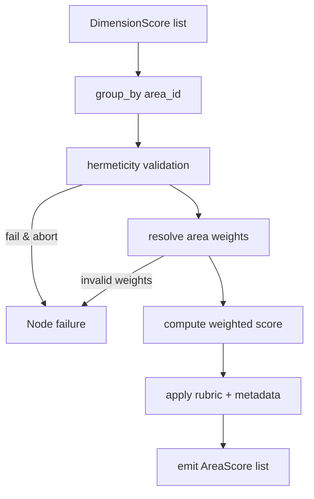
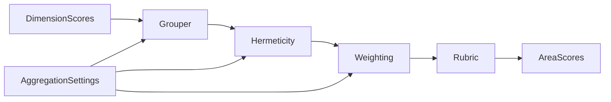
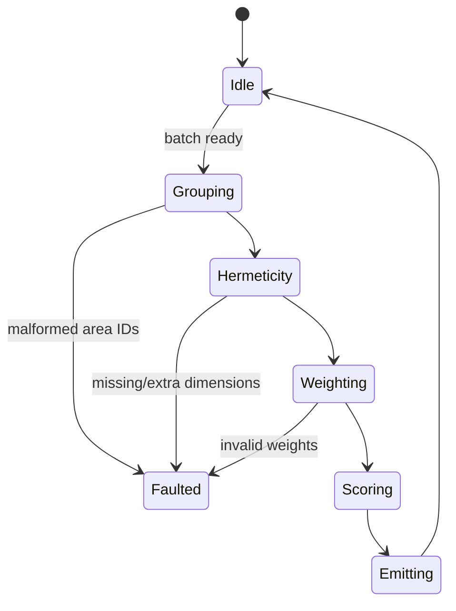
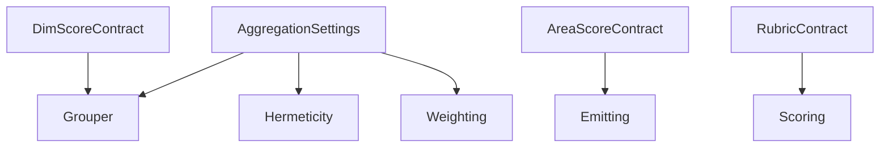

# P05-EN v1.0 — Phase 5 (Policy Area Aggregation) Doctrine

## Canonical Node Summary
- **Node ID:** N5  
- **Upstream:** N4 (Dimension Aggregation)  
- **Downstream:** N6 (Cluster Aggregation)  
- **Purpose:** Produce one `AreaScore` per policy area (PA01–PA10) by aggregating validated `DimensionScore` objects, enforcing hermeticity and area-specific weights.

## Input Contract
- **Route:** Output list from N4.
- **Format:** List[`DimensionScore`] with fields `area_id`, `dimension_id`, `score`, `quality_level`, `validation_details`.
- **Preconditions:**
  - Each policy area’s dimension set matches `aggregation_settings.area_expected_dimension_counts`.
  - No duplicate `(area_id, dimension_id)` entries.
  - Monolith present in config; AggregationSettings cached.
- **Forbidden inputs:** partially aggregated structures, area IDs outside PA01–PA10, missing dimension info.

## Output Contract
- **Type:** List[`AreaScore`].
- **Cardinality:** Exactly 10 entries (PA01–PA10). Missing data triggers `validation_passed=False` entries with error metadata.
- **Postconditions:** Each AreaScore stores child DimensionScores, computed score, quality band, hermeticity diagnostics, optional `cluster_id` placeholder.

## Internal Flow
1. **Grouping:** Group DimensionScores by `aggregation_settings.area_group_by_keys` (default `["area_id"]`).
2. **Hermeticity check:** Validate duplicates, missing dimensions, unexpected dimensions.
3. **Weight resolution:** Use `policy_area_dimension_weights`; fallback to equal weights if mapping incomplete.
4. **Scoring:** Apply weighted average, clamp to `[0, 3]`, apply area rubric thresholds (same as Phase 4).
5. **Emission:** Build AreaScore list with references to child dimensions; optionally annotate `cluster_id` later in N6.

### Control-Flow Graph

### Data-Flow Graph

### State-Transition Graph

### Contract-Linkage Graph

## Complexity Constraints
- **Subnodes:** max 5 (grouping, hermeticity, weighting, scoring, emission).
- **Decision depth:** ≤3 (hermeticity results + weight fallback).
- **Coupling:** limited to AggregationSettings, rubric, ClusterAggregator interface.

## Error Handling
- Hermeticity violation: raise `HermeticityValidationError` if `abort_on_insufficient=True`; otherwise emit area with failure metadata.
- Weight anomalies: raise `WeightValidationError`.
- Missing weights and missing dimensions simultaneously trigger node failure.
- Monolith absent: fatal log + empty output.

## Contracts & Telemetry
- **Input contract:** `DIM-SCORE-V1`.
- **Settings contract:** `AGG-SET-V1`.
- **Output contract:** `AREA-SCORE-V1`.
- **Signals:** `N5.items_total`, `hermeticity_failures`, `weight_fallback_count`.

## Upstream/Downstream Links
- **Upstream guarantees:** Unique `area_id`, consistent dimension mapping, coverage metadata.
- **Downstream expectations:** Receives list with `cluster_id=None` placeholders; N6 will assign actual IDs using monolith definitions.

## Change Management
- Weight schema or rubric modifications require version bump `(P05-EN_vX.Y)`.
- Any change affecting hermeticity constraints must update both EN/ES docs and the contract definitions in `src/farfan_core/utils/validation/aggregation_models.py`.
