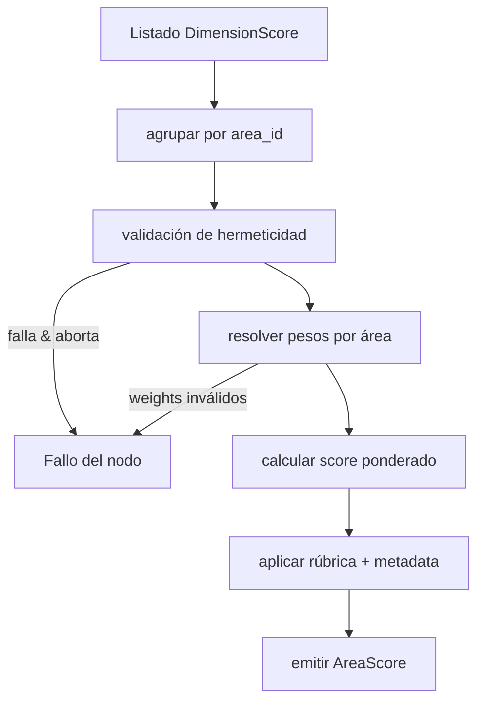
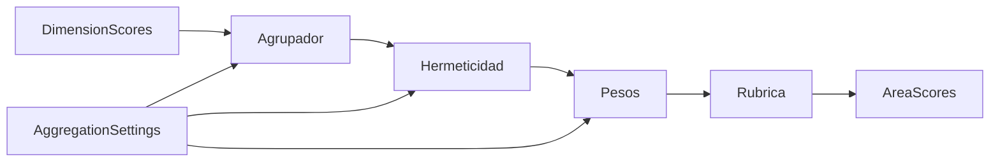
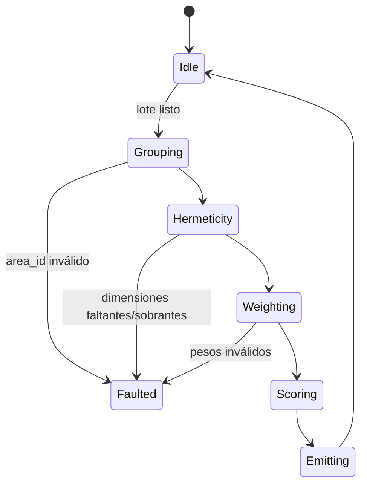
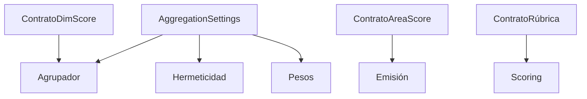

# P05-ES v1.0 — Doctrina de Fase 5 (Agregación de Áreas de Política)

## Resumen del Nodo Canónico
- **ID del nodo:** N5  
- **Upstream:** N4 (Agregación de Dimensiones)  
- **Downstream:** N6 (Agregación de Clústeres)  
- **Propósito:** Producir un `AreaScore` por cada área de política (PA01–PA10) agregando `DimensionScore` validados y asegurando hermeticidad con pesos específicos.

## Contrato de Entrada
- **Ruta:** Lista emitida por N4.
- **Formato:** `List[DimensionScore]` con campos `area_id`, `dimension_id`, `score`, `quality_level`, `validation_details`.
- **Precondiciones:**
  - El conjunto de dimensiones por área coincide con `aggregation_settings.area_expected_dimension_counts`.
  - No existen duplicados `(area_id, dimension_id)`.
  - El monolito está disponible en `config["monolith"]`; `AggregationSettings` ya está cacheado.
- **Entradas prohibidas:** estructuras parcialmente agregadas, IDs fuera de PA01–PA10, dimensiones faltantes.

## Contrato de Salida
- **Tipo:** `List[AreaScore]`.
- **Cardinalidad:** Exactamente 10 entradas. Las áreas con datos faltantes se emiten con `validation_passed=False` y metadata de error.
- **Postcondiciones:** Cada AreaScore conserva las DimensionScores hijas, el score calculado, la banda de calidad, diagnósticos de hermeticidad y un placeholder `cluster_id`.

## Flujo Interno
1. **Agrupación:** Agrupar DimensionScores por `aggregation_settings.area_group_by_keys` (default `["area_id"]`).
2. **Hermeticidad:** Validar duplicados, dimensiones faltantes y dimensiones inesperadas.
3. **Pesos:** Aplicar `policy_area_dimension_weights`; fallback a pesos iguales si faltan entradas.
4. **Puntaje:** Calcular promedio ponderado, recortar a `[0, 3]`, aplicar umbrales de rúbrica (mismos que N4).
5. **Emisión:** Construir la lista AreaScore con referencias a dimensiones; `cluster_id` será asignado en N6.

### Grafo de Control

### Grafo de Flujo de Datos

### Grafo de Transición de Estados

### Grafo de Enlace Contractual

## Restricciones de Complejidad
- **Subnodos:** máximo 5 (agrupación, hermeticidad, pesos, scoring, emisión).
- **Profundidad decisional:** ≤3.
- **Acoplamiento:** limitado a AggregationSettings, rúbrica y la interfaz del ClusterAggregator.

## Manejo de Errores
- Violación de hermeticidad: lanzar `HermeticityValidationError` si `abort_on_insufficient=True`; en modo tolerante emitir área fallida.
- Anomalías de pesos: lanzar `WeightValidationError`.
- Ausencia simultánea de pesos y dimensiones correctas: fallo del nodo.
- Monolito ausente: error fatal + salida vacía.

## Contratos y Telemetría
- **Contrato de entrada:** `DIM-SCORE-V1`.
- **Contrato de settings:** `AGG-SET-V1`.
- **Contrato de salida:** `AREA-SCORE-V1`.
- **Señales:** `N5.items_total`, `hermeticity_failures`, `weight_fallback_count`.

## Enlaces Upstream/Downstream
- **Upstream:** debe garantizar IDs únicos y metadata de cobertura.
- **Downstream:** recibe lista con `cluster_id=None`; N6 asignará los clústeres reales según el monolito.

## Gestión de Cambios
- Cambios en pesos o rúbricas requieren incrementar la versión (`P05-ES_vX.Y`).
- Cualquier ajuste de hermeticidad debe reflejarse simultáneamente en los contratos de `src/farfan_core/utils/validation/aggregation_models.py` y en ambos idiomas.
